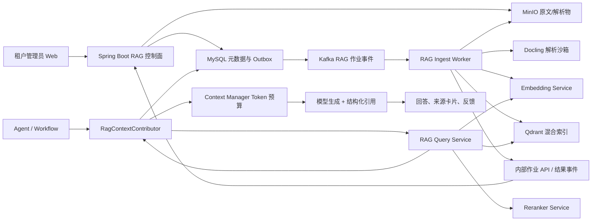
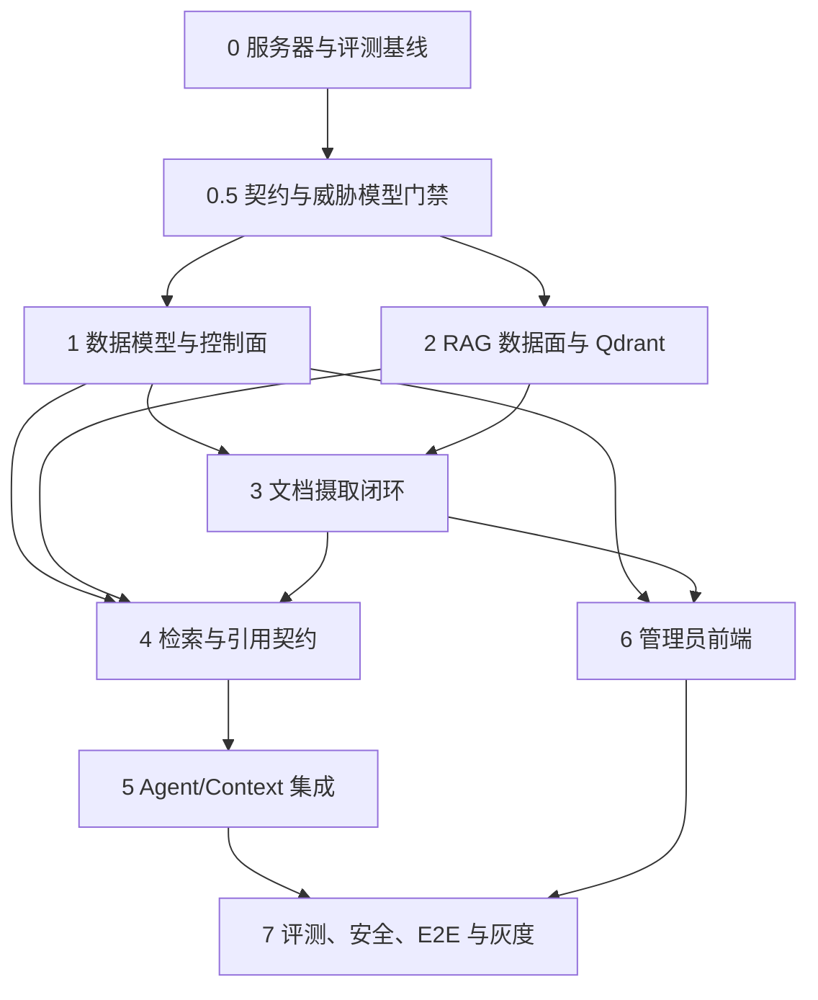

# 企业级多租户 RAG 闭环架构设计

## 1. 设计结论

本项目的 RAG 不应实现成“上传文件→切字符串→存向量→相似度 TopK”。推荐采用可评测、可回滚的混合检索体系：

> 结构化文档解析 + 层级切分 + Dense/Sparse 双路召回 + RRF 融合 + Cross-Encoder 重排 + 父子/邻居扩展 + Token 预算选择 + 强制引用 + 权限后验校验 + 离线评测闭环。

控制面继续留在现有 Spring Boot 模块化单体内，复用租户身份、管理员角色、MySQL、MinIO、Kafka、Context Manager 和 Agent/Workflow；计算与索引面部署在新的 `RAG-Server`，使用 Python RAG Service、Docling、Embedding/Reranker 服务和 Qdrant。

核心原则：

1. **MySQL 是业务真相，Qdrant 是可重建索引**。租户、权限、文档有效版本和删除状态不能只存在向量库。
2. **权限在检索前强制过滤，返回后再次校验**。模型、浏览器和文档内容都不能决定 tenantId 或可访问知识库。
3. **原文、解析物、切片、Embedding、索引均版本化**。任何模型/切分策略升级都通过新代次构建和灰度切换完成。
4. **RAG 是代码强制执行的上下文贡献者**。绑定了知识库的 Agent 在模型调用前执行检索，不能只靠提示词要求模型“自行检索”。
5. **先评测再调参**。模型、TopK、权重、阈值和切片大小均进入 retrieval profile，不把经验值硬编码成永久真理。
6. **默认拒绝无证据回答**。证据不足时明确返回“知识库中没有足够依据”，不让大模型补全企业事实。

## 2. 现有工程基础与缺口

### 2.1 可直接复用

- Web 已有 `/rag` 懒加载路由和 `KnowledgeBaseView.vue` 占位页。
- MySQL 已有 `rag_knowledge_base`、`rag_document`、`rag_chunk` 三张占位表及 MyBatis DAO。
- `ContextContributor` 已明确给 RAG 预留扩展口，`ContextFragmentType.RAG`、`ragTokens` 和 Context Insight 统计已存在。
- 现有附件链路已有 MinIO、SHA-256、PDFBox、Apache POI、Markdown/PDF/DOCX 文本提取和字节上限。
- `TenantContextHolder`、owner/admin 角色、Agent/Workflow 配置、Kafka 事件总线、Trace/AiLog 均可复用。

### 2.2 必须补齐

- 当前三张 RAG 表没有文档不可变版本、摄取作业、租约重试、索引 profile/代次、Agent 绑定、ACL、评测和反馈模型。
- 当前 `ContextAssembleRequest` 没有当前问题、Agent/Workflow 来源和知识库策略，RAG 无法正确查询。
- 当前 `ragTokens` 默认是 0，且贡献结果只是字符串，无法把引用结构传到消息和前端。
- 当前前端路由只检查登录，没有按 owner/admin 隐藏管理入口或阻止普通用户进入。
- PDFBox/POI 解析适合聊天附件的轻量文本提取，但不足以稳定恢复复杂 PDF 布局、标题层级和表格。

## 3. 总体架构



### 3.1 Spring Boot 控制面

新增独立 `domain/rag` 聚合，保持现有 API → Trigger → Domain → Infrastructure 边界：

- 鉴权、管理员写权限、普通成员检索权限；上传、删除、导出、绑定和 ACL 变更必须实时校验当前 tenant membership/role，不能只相信可能尚未过期的 JWT roleCode。
- 知识库、文档、版本、作业、Agent 绑定和评测用例生命周期。
- MinIO 上传票据/完成确认、SHA-256 去重、MySQL Outbox。
- 调用内部 Retrieval API，按 MySQL 批量后验校验候选版本后注入 Context Manager。
- 文档删除先在 MySQL 进入不可检索状态，再异步删向量和对象，避免删除窗口继续泄漏。

### 3.2 RAG 数据面

RAG 服务器部署三个逻辑进程，可先同机不同容器：

- `rag-api`：FastAPI + Pydantic，内部检索、调试检索、健康和指标接口。
- `rag-worker`：消费 Kafka 文档 ID 事件，执行解析、切分、向量化、索引和清理；不在 Kafka 传文件正文，也不持有业务 MySQL 凭据。
- `rag-model`：可替换的 Embedding/Reranker Provider，首期 CPU/AVX2 推理，支持批处理和并发上限。

Qdrant、模型和 Worker 只暴露在内部网络；公网浏览器永远不能直接访问 Qdrant、模型端口或 MinIO 管理端。

### 3.3 服务契约与所有权

- Java 控制面独占 RAG 业务表写权限。Worker 通过带服务身份的内部作业 API 执行 `claim/heartbeat/checkpoint/complete/fail/cancel-ack`，所有状态迁移和 CAS 均由 Java 落 MySQL。
- Kafka 只是唤醒与削峰通道，事件至少包含 `eventId/tenantId/jobId/documentVersionId/pipelineVersion/operation/traceId`；消费者拿到事件后仍需向控制面 claim，不能凭事件正文直接执行。
- 事件统一包含 `aggregateId/aggregateRevision/schemaVersion/occurredAt`，按 aggregateId 分区；消费者记录幂等结果，旧 revision 拒绝，重试耗尽进入 DLT 并由管理员可见地处置。
- Worker 产出的 parsed object key、chunk manifest、point IDs 和校验摘要通过 complete API 回报；控制面校验作业租约、版本和租户后才发布 active version。每次 claim 递增 `fencing_token`，所有 checkpoint、upsert 和 complete 均携带 `job_revision + fencing_token + generation_id`，过期 Worker 的结果一律拒绝。
- 在线检索使用版本化内部 API，例如 `POST /internal/rag/v1/retrievals`；浏览器的“召回实验室”必须经过 Java 管理接口转发，不能直连 rag-api。
- 所有内部写请求携带幂等键和 traceId；服务 JWT 的 audience、租户范围与短 TTL 固定，网络层再使用 mTLS 或 IP allowlist。

## 4. 文档摄取闭环

### 4.1 上传与校验

1. owner/admin 创建知识库或选择现有知识库。
2. 后端验证可信 tenantId、角色、知识库状态、租户配额和并发作业上限。
3. 支持 `.pdf`、`.md/.markdown`、`.docx`；遗留 `.doc` 通过受限 LibreOffice 转换沙箱转成 DOCX，不能直接解析时给出明确失败原因。
4. 同时校验扩展名、MIME、magic bytes、文件大小、PDF 页数、DOCX ZIP entry/展开大小、UTF-8 和 SHA-256；可接 ClamAV，解析进程禁网、只读根文件系统、临时目录限额、CPU/内存/PID/超时限制。
5. 原文件写入 MinIO 的 RAG 专用 bucket，object key 必须含 tenantId/kbId/documentId/versionId，数据库只保存定位和 hash，不保存临时签名 URL。
6. 同租户同知识库相同 hash 默认提示复用；管理员仍可选择作为新逻辑文档。首期物理去重严格限制在租户内，不能通过 hash 告知调用方其他租户是否存在相同文件。
7. 大文件不经过 `MultipartFile -> byte[]` 整体进入 JVM：使用流式/分片上传或短期 presigned PUT。完成确认时后端重新 HEAD 并流式计算 hash/校验 object key、大小和所属 upload session；过期 session 与孤儿对象由补偿任务清理。

### 4.2 异步状态机

```text
UPLOADING -> QUEUED -> VALIDATING -> PARSING -> NORMALIZING
          -> CHUNKING -> EMBEDDING -> INDEXING -> VERIFYING -> READY

任一步 -> RETRY_WAIT -> 对应步骤
任一步 -> FAILED
READY  -> REINDEXING -> READY
READY  -> DELETING -> DELETED
```

- `rag_ingest_job` 使用 `job_id + document_version_id + pipeline_version` 幂等键、lease owner、lease expiry、attempt、next_retry_at 和错误分类。
- MySQL 事务内写文档版本与 Outbox；发布器只发送 ID。Kafka 至少一次交付，Worker 以作业状态/CAS 防止重复副作用。
- 每一步写 checkpoint；Embedding 批次和 Qdrant point ID 确定性生成，重试使用 upsert。
- READY 前执行数量、hash、向量维度和随机抽样检索验证；验证不通过不能发布。
- 管理员取消时，控制面先以 CAS 把作业置为 `CANCEL_REQUESTED`；Worker 在解析前、每个 embedding batch 前和每次 Qdrant upsert 前后检查取消令牌，最终进入 `CANCELLED`。已产生的临时对象/point 按 `job_id + generation` 清理，旧 active version 不受影响。
- 换版采用 build-then-publish：显式保存 `candidate_generation_id` 和 `active_generation_id`。新代次以不可见 generation 完整构建，验证后在单个 MySQL 事务中切换 active generation；每次检索必须携带 Java 给出的可信 active generation 作为 Qdrant filter。失败或取消只清理 candidate，旧 generation 保留一个回滚窗口后再异步清理。

### 4.3 解析与标准化

主解析器采用 Docling：它支持 PDF、DOCX、Markdown，并将文档统一为含正文树、标题、表格、图片和页码信息的 `DoclingDocument`；官方 HybridChunker 能在文档层级基础上按目标 tokenizer 拆分/合并，并为跨片表格重复表头。[Docling 支持格式](https://docling-project.github.io/docling/usage/supported_formats/)、[Docling Chunking](https://docling-project.github.io/docling/concepts/chunking/)

处理策略：

- 保存不可变 `parsed_document.json` 到 MinIO，便于换切分策略时不重新跑重解析。
- 保留 `display_text` 与 `search_text` 两份：前者用于引用展示，后者做 Unicode/空白/断词规范化；不能用清洗后的文本替代原始引用。
- PDF 记录页码和 bbox；低文本密度页才进入 OCR，避免所有 PDF 都付 OCR 成本。
- DOCX 保留标题级别、段落、列表、表格、脚注和超链接；嵌入对象和宏不执行。
- Markdown 保留标题路径、代码围栏、表格和链接；代码块与表格使用专用序列化，不能按普通段落盲切。
- 识别重复页眉页脚、断行连字符和空页面，并记录 parse quality，而不是静默丢弃。
- PDFBox/POI 只作为简单文档快速路径或 Docling 失败后的可观测降级，不把降级结果伪装为等价质量。

### 4.4 层级与语义切分

首期采用“结构优先、token 约束、父子双层”而非固定字符切片：

- Child chunk：目标 256–480 tokens，用于精确召回；标题、段落、列表项、代码块、表格行保持完整。
- Parent chunk：目标 800–1500 tokens，用于重排后上下文扩展；child 保存 `parent_chunk_id`。
- 只有同一结构节点跨界时才保留约 10% overlap；通过 semantic hash 去掉重复页眉、邻接 overlap 和重复文档造成的冗余。
- Embedding 文本使用确定性上下文前缀：`文档标题 > 标题路径 > 页码/表头 + child text`。不为每个 chunk 调一次大模型生成“上下文”，避免成本和不稳定性。
- 表格跨片重复表头；问答/条款/代码等结构可由策略插件选择不同 chunker。
- 所有 chunk 带 `parser_version/chunker_version/tokenizer_version/content_hash/page/heading_path/language`。

## 5. 索引与模型技术选型

### 5.1 向量数据库：Qdrant

首选 Qdrant，原因是同一个 point 原生支持多个 named dense/sparse vectors、payload filter、混合多阶段 Query API、RRF/DBSF、HNSW、量化和 snapshot；它适合当前独立服务器和强租户过滤场景。[混合查询](https://qdrant.tech/documentation/search/hybrid-queries/)、[多租户](https://qdrant.tech/documentation/tutorials/multiple-partitions/)、[量化](https://qdrant.tech/documentation/quantization/)

数据组织：

- 每个 embedding profile 一个 collection，不为每个租户/知识库创建 collection。
- point 使用 UUID；named vectors 至少为 `dense` 与 `sparse`。
- payload：tenant_id、kb_id、document_id、document_version_id、chunk_id、parent_chunk_id、visibility、language、page、heading、content_hash、pipeline_version、active。
- 在写入数据前创建 tenant_id（tenant index）、kb_id、document_id、document_version_id、active 等 payload index。
- 小租户共享 shard；大租户达到阈值后才提升到专属 shard，避免上千 collection 的资源浪费。
- 单节点首期启用 WAL、持久化 XFS block storage、API key/TLS、strict mode、查询和 upsert 限额；6333/6334 不开放公网。
- 数据量达到内存门槛后，在评测集证明 Recall@K 降幅可接受再启用 int8 scalar quantization，不能只为省内存直接开启。
- 所有 Qdrant 查询只能经过统一 `AuthorizedQueryBuilder`，它强制追加 tenant、kb、active generation 和状态过滤；调用方不能提交原生 filter。point-by-id、parent/neighbor 和调试接口同样执行该规则，并用跨租户负向测试固化。

不首选 pgvector：本项目主库是 MySQL，引入 PostgreSQL 仍是新增数据库；pgvector 虽支持 HNSW/IVFFlat，但近邻索引过滤需要 iterative scan/分区等额外调优，Dense/Sparse 融合和多阶段查询不如 Qdrant 直接。[pgvector 官方说明](https://github.com/pgvector/pgvector)

不首选 Elasticsearch/OpenSearch：它们的全文检索和 Hybrid Search 很强，但在当前 15 GiB 单机上会与 Docling、Embedding、Reranker 争抢 JVM/页缓存；只有未来需要复杂企业搜索、聚合、高亮、同义词运营和非 RAG 搜索时再评估。

### 5.2 Embedding 与 Sparse Retrieval

模型必须通过项目自己的中文/英文/术语评测集选择，不把排行榜当生产结论。建议预置两个 profile：

| Profile | Dense | Sparse | 适用 |
|---|---|---|---|
| `quality-multilingual` | BAAI/bge-m3 dense | BGE-M3 lexical weights | 中英文混合、长文档、效果优先 |
| `balanced-cpu` | multilingual-e5-base 或评测胜出的同级模型 | Qdrant BM25/多语言 tokenizer | CPU 延迟和资源优先 |

BGE-M3 可同时生成 dense、sparse 和 multi-vector 表示，支持 100+ 语言和最长 8192 token，是质量 profile 的合理候选，但首期只启用 dense+sparse，ColBERT multi-vector 必须在离线收益明显时再开启，避免索引膨胀。[BGE-M3 论文](https://arxiv.org/abs/2402.03216)

模型服务要求：

- `EmbeddingProvider` 接口隔离模型；批量摄取与在线查询使用相同 model revision、tokenizer 和 normalize 规则。
- 摄取按 token 数动态 batch；在线查询单独线程池和优先队列，不能被批量建库饿死。
- query embedding 以 `tenant/profile/query_hash` 短 TTL 缓存；文档 embedding 以 `profile/content_hash` 永久复用。
- 使用 CPU/AVX2 的 ONNX/int8 或 Hugging Face TEI CPU 镜像前先做精度和 P95 基准；TEI 官方支持 x86_64 CPU 和 reranker serving。[TEI 支持矩阵](https://huggingface.co/docs/text-embeddings-inference/en/supported_models)
- 模型 revision 必须固定 SHA；升级创建新 profile 和新 collection，双写/影子检索后切换，不原地覆盖向量语义。
- 每个可部署 profile 必须冻结完整实现清单：模型仓库与 SHA、tokenizer、推理运行时、dense 维度/归一化、sparse 生成组件、Qdrant 版本和 collection schema。TEI 只承担其明确支持的 dense/reranker 服务；BGE-M3 lexical weights 由独立、经过基准验证的 provider 生成，不能假定 TEI 自动提供 sparse 输出。

### 5.3 Cross-Encoder Reranker

- Hybrid 候选 Top 30–60 才进入 reranker，最终保留 8–12 个 child；不对整个库使用 cross-encoder。
- 质量候选为 `bge-reranker-v2-m3`，平衡候选为 `bge-reranker-base` 或评测胜出的 multilingual base 模型。BGE 官方说明 cross-encoder 适合对第一阶段 TopK 做高质量重排；v2-m3 为 568M 多语言模型，base 为 278M。[BGE Reranker](https://bge-model.com/tutorial/5_Reranking/5.2.html)
- 在线请求设硬超时；reranker 超时可显式降级到 RRF 结果，响应必须标记 `degraded=true`，不能静默隐藏降级。

## 6. 极细召回链路

### 6.1 查询理解

1. Java 从当前数据库中的 membership、Agent binding、KB 状态构造 tenantId、userId、role、agentId、kbIds、active generations 和 retrieval profile，生成带版本的 authorization scope；浏览器只能提交 question。
2. 规范化 Unicode、空白和大小写，但保留原 query 用于审计；检测语言、数字、版本号、日期、专有名词、文件名和条款编号。
3. 使用当前问题 + 最近少量用户轮次做指代补全；长期摘要和旧 RAG 内容不能直接变成新检索事实。
4. 轻量规则先判断 greetings、纯创作和无需企业知识的问题；Agent 标记 `rag_required=true` 时仍必须检索。
5. 只有复合问题、强歧义或多实体比较才调用现有 LLM 生成 typed JSON：`standalone_query/sub_queries/filters/exact_terms`，最多 3 个子查询。解析失败回退原 query。
6. HyDE、LLM per-chunk contextualization、GraphRAG 不进入默认链路；只有离线评测证明收益超过额外延迟/成本才按 profile 开启。

### 6.2 多路候选生成

对原 query 和必要子查询并行执行：

- Dense ANN：语义召回 Top 40–60。
- Sparse/BM25：精确术语、编号、姓名、缩写 Top 40–60。
- 元数据精确通道：文件名、标题、章节、条款号命中，作为加权候选而非绕过权限。
- 每一路都强制 filter：tenant_id、允许 kbIds、active、document status/version、可见范围；普通用户不能传任意 kbIds 扩权。
- 无标注集时用 RRF 融合，避免直接相加不同尺度的 dense/sparse 分数；有标注集后再训练/搜索 Weighted RRF 或 DBSF 参数。Qdrant 官方也把 RRF 作为无可靠分数先验时的安全默认。

### 6.3 去重、重排与扩展

1. 按 chunk semantic hash 去重，重叠窗口只保留最高分版本。
2. 同一 document 首轮最多保留 3–4 个候选，防止单篇长文淹没结果；精确命中可放宽。
3. Cross-Encoder 重排 Top 30–60；保存原始分、各路 rank、RRF 分和 rerank 分以便调试。
4. 对 Top child 拉取 parent、前后邻居、表头和标题路径；邻接内容只在新增信息且不超预算时加入。
5. 用 MMR/相似度阈值控制证据多样性，再以 score、coverage、token cost 做预算选择；不是简单取前 N 个。
6. Java 依据 MySQL 一次批量校验 document_version/generation 仍为 READY/ACTIVE 且属于当前 tenant/kb；剔除刚删除、刚换版或索引残留候选。缓存键必须包含 authorization scope version、active generations 和 profile version，ACL/绑定/发布/删除事件立即失效缓存。
7. 低于检索置信阈值或校验后无候选时，返回 `NO_EVIDENCE`，不把低相关片段硬塞给模型。

### 6.4 上下文与引用

RAG Service 返回 typed evidence，不返回一段已经拼好的提示词：

```json
{
  "retrievalId": "ret_xxx",
  "profileVersion": "rp_xxx",
  "degraded": false,
  "evidence": [
    {
      "citationId": "C1",
      "kbId": "kb_xxx",
      "documentId": "doc_xxx",
      "documentVersionId": "dv_xxx",
      "chunkId": "chk_xxx",
      "title": "制度名称",
      "page": 12,
      "headingPath": ["第三章", "请假制度"],
      "text": "...",
      "score": 0.91
    }
  ]
}
```

- `RagContextContributor` 在 Context Manager 内按 `ragTokens` 预算序列化 evidence，引用 ID、标题、页码和正文一起进入模型。
- Context 请求契约需增加 `runId/contextRevision/question/agentId/binding/deadline/cancellationToken` 和结构化 evidence metadata；在 rewrite、召回、rerank、模型调用前都执行 RunExecutionGate。取消后不能继续触发检索、模型或工具副作用。
- 模型只能引用此次 evidence envelope 中的 citationId；回答保存 `retrieval_id + used_citation_ids`。
- 后端 Citation Validator 拒绝不存在、跨租户或过期引用；前端来源卡片通过受权 API 获取文档片段/页码，不接触 MinIO 永久地址。
- 文档内容一律作为“不可信资料”包裹，明确禁止其改变系统指令、发起工具、泄漏其他租户或把文档内命令当操作授权。
- RAG 证据不写进长期会话记忆；压缩只保存“用户问过什么、使用了哪些 citationId”，不把模型基于旧版本文档生成的答案固化成永久事实。

## 7. 多租户、权限与安全

- 写操作：仅 `owner/admin`；前端路由/导航隐藏只是体验，Trigger/Domain 必须再次校验角色。
- 读操作：tenant member 可检索本租户已绑定、已发布知识库；未来 group/user ACL 通过 `rag_acl_binding` 扩展。
- tenantId 永远取 `TenantContextHolder` 或内部服务凭据，不接受浏览器字段；内部 RAG API 使用 mTLS 或短期 service JWT，并携带 traceId/retrievalId。
- Qdrant payload filter 是第一道隔离，MySQL 后验校验是第二道；日志和指标不记录原文、完整 query、向量或签名 URL。
- 文件解析进程无网络、非 root、只读 rootfs、drop capabilities、临时 volume、超时与资源限制；防 ZIP bomb、PDF bomb、DOCX 嵌入对象和恶意超链接。
- 文档删除事务先令 MySQL 不可读，再发清理事件；即使 Qdrant/MinIO 清理重试，查询后验校验也会阻断泄漏。
- 删除采用 tombstone 与保留期：先立即停止检索，再异步清理 Qdrant/解析物/原文；每一步可重试且记录证明。恢复仅允许在原文尚未物理删除且审计策略允许时创建新版本，不能复活旧索引状态。
- 知识库导出、下载、删除、重建、Agent 绑定和权限变更记录审计事件。
- `rag_required=true` 时，RAG API、Embedding、Qdrant、权限校验或后验校验任一失败都禁止进入模型生成；仅 `optional` 可在标记 degraded 后降级。在线查询配置 deadline、bulkhead、熔断，并始终优先于批量摄取。

## 8. 数据模型重设计

现有三表可迁移但不应原样直接实现：

| 表 | 职责与关键字段 |
|---|---|
| `rag_knowledge_base` | kb_id、tenant_id、name、status、retrieval_profile_id、quota、revision |
| `rag_document` | 逻辑文档，document_id、kb_id、display_name、active_version_id、status |
| `rag_document_version` | 不可变版本，version_id、object_key、sha256、mime、size、parser/chunker/model version、parse quality、status |
| `rag_ingest_job` | job/lease/attempt/checkpoint/progress/error/idempotency/next_retry_at |
| `rag_chunk` | version_id、chunk/parent/neighbor、display/search text、token、page/bbox/heading/hash、vector point id |
| `rag_retrieval_profile` | dense/sparse/reranker 模型 revision、TopK、融合、阈值、chunk policy、context budget、版本 |
| `rag_agent_binding` | agent/workflow node 与 kb/profile、required、max_tokens、priority |
| `rag_acl_binding` | kb/document 与 tenant/role/group/user subject，首期可只用 tenant member |
| `rag_retrieval_record` | retrieval_id、trace、profile、latency、candidate counts、no-hit/degraded，不存默认全文 |
| `rag_feedback` | retrieval/message、rating、reason、citation click、管理员标注 |
| `rag_eval_case/run/result` | query、相关文档/chunk、期望引用、profile、指标与回归结果 |
| `outbox_event` | 文档发布、重建、删除、配置失效事件，保证事务后投递 |

所有 RAG 表都冗余非空 `tenant_id`，关键唯一键/关联包含业务边界，例如 `(tenant_id,kb_id,document_id)`、`(tenant_id,document_version_id,chunk_index)`；Repository 查询不得提供无 tenantId 的生产方法。迁移必须先清洗和回填历史 `tenant_id IS NULL` 数据，引用详情、下载、重试和删除接口一律使用 `tenant_id + resource_id`。

## 9. 前端产品设计

`/rag` 从占位页升级为管理员工作台：

1. **知识库列表**：名称、状态、文档数、chunk 数、最近更新、使用 Agent、存储/配额、健康度。
2. **知识库详情**：文档、摄取队列、召回测试、配置、评测五个页签。
3. **上传区**：拖拽/批量上传、支持格式和上限、文件 hash 去重提示、每文件进度、解析阶段、取消/重试。
4. **文档表**：READY/PROCESSING/FAILED/DELETING、版本、页数、chunk 数、失败步骤、重新解析、换版、删除和审计。
5. **召回实验室**：输入问题，展示 query rewrite、Dense/Sparse 候选、RRF/rerank 分、过滤原因、最终证据和阶段耗时；只向管理员开放。
6. **Agent 绑定**：选择哪些 Agent/Workflow 使用哪些 KB，RAG required/optional、Token 预算和 profile。
7. **评测看板**：golden case、Recall@K/nDCG/MRR、上下文精确率、引用正确率、P95、no-hit 和版本对比。

所有写按钮有 pending/success/error/disabled reason，作业进度用 SSE 或有退避的轮询；普通成员不显示管理导航，直接访问返回 403 页面。

召回实验室的每个候选仍需执行实时文档权限校验；query、片段和评分调试记录采用短保留期并纳入审计。片段、标题、文件名和超链接统一转义，Markdown 禁止渲染原始 HTML，避免把恶意文档变成管理端 XSS。

## 10. 评测、观测与持续优化

### 10.1 离线检索评测

- 每租户管理员维护 golden set：问题、相关 document/chunk、可接受答案要点和引用。
- 第一阶段指标：Recall@5/10/20、MRR@10、nDCG@10、HitRate、每文档多样性。
- 第二阶段指标：rerank 后 Recall/nDCG、Context Precision/Recall、Faithfulness、Answer Relevance、Citation Precision/Coverage。
- RAGAS 提供 Context Precision、Context Recall、Faithfulness 等指标，但 LLM Judge 只作为辅助；关键发布门禁必须包含人工标注检索集，避免“模型评价模型”漂移。[RAGAS 指标](https://docs.ragas.io/en/latest/concepts/metrics/available_metrics/)
- 每个 profile 变更跑固定回归；例如 Recall@10 不得显著下降、跨租户结果必须恒为 0、P95 不超预算，才允许灰度。

### 10.2 在线反馈

- 记录 no-hit、降级、用户赞踩、原因、来源点击、复制引用、管理员纠错；点击不是天然正样本，只作为弱信号。
- 支持 shadow retrieval：旧 profile 正常回答，新 profile 只记录候选，不影响用户；积累数据后再切换。rewrite、exact channel、neighbor expansion、MMR 均用独立 feature flag 和消融评测加入，首个质量闭环先交付结构切分、dense+sparse、RRF、rerank 与引用。
- 热门问题缓存最终 evidence IDs 而非永久答案；文档版本/ACL/profile 变化通过事件失效。

### 10.3 可观测性

- 全链路 trace：upload→job→parse→chunk→embed→upsert，以及 chat→rewrite→dense/sparse→fusion→rerank→validate→generation。
- 指标：队列 lag、每阶段耗时/失败、tokens/chunks、模型 batch/QPS、Qdrant P50/P95、候选数、过滤数、rerank timeout、cache hit、no-hit、引用覆盖。
- 使用现有 `AiLog.rag()` 扩展结构化事件，并参考 OpenTelemetry GenAI 语义约定；默认不记录大参数和正文。[OpenTelemetry GenAI](https://opentelemetry.io/docs/specs/semconv/registry/attributes/gen-ai/)

## 11. RAG 服务器部署基线

只读审计结果：16 核 E5-2682 v4、15 GiB RAM、AVX2、40 GiB XFS 根盘、无 Swap、无 Docker；系统是 CentOS 7。CentOS 官方已于 2024-06-30 结束 CentOS Linux 7 生命周期，因此不应直接作为新的生产 RAG 基座。[CentOS 生命周期](https://www.centos.org/centos-linux/)

生产前置：

1. 优先重装 Rocky Linux 9 或 Ubuntu 24.04 LTS；如果无法重装，必须形成独立风险接受，不把 EOL 系统包装为安全生产环境。
2. 安装 Docker Engine/Compose，配置非 root 容器、日志轮转、memory/PID/CPU limits、内部网络和健康检查。
3. 40 GiB 只适合小规模首期；原文继续放现有 MinIO，Qdrant 使用本地 XFS block storage。生产前至少预留索引、WAL、临时解析和两份 snapshot 的容量，容量不足则增加独立 SSD 数据盘。
4. 增加低 swappiness 的应急 Swap，但模型和 Qdrant 常态工作集必须在 RAM 内；在线模型与批量摄取分别限流。
5. Qdrant 6333/6334、模型、rag-api 不开放公网；仅允许现有应用服务器通过私网/VPN/受限防火墙访问，外层启用 TLS/mTLS。
6. 每日 Qdrant snapshot 上传到对象存储，定期做新实例恢复演练；Qdrant snapshot 包含 collection 数据和配置，但 collection alias 需单独备份。[Qdrant Snapshot](https://qdrant.tech/documentation/snapshots/)
7. 首期单机是明确的故障域，不宣称高可用。rag-api/Qdrant 不可用时，绑定为 `required` 的 Agent 返回“知识库暂不可用”且不生成企业事实；`optional` Agent 可降级但必须在响应和观测中标记。达到业务连续性要求后再增加第二节点和副本。

该服务器只能定义为小规模单节点试运行。首期默认 `balanced-cpu`、单解析 Worker、在线推理独立并发闸门，并按需加载 reranker/OCR；snapshot 上传 MinIO 后限制本地保留。各进程硬上限必须通过压力基准确定且为文件页缓存、Qdrant compaction/WAL 和容器开销预留余量，不能把理论上限简单相加塞满 15 GiB。生产规模需增加 RAM/独立 SSD，或拆分模型与 Qdrant。

## 12. 分阶段交付蓝图



### Step 0：服务器与评测基线

- 重装/升级受支持 OS、安装容器运行时、资源/防火墙/备份基线；准备 30–100 个企业样例问答和相关文档标注。
- 对两个 embedding profile、两个 reranker profile 做 CPU 吞吐、P95、内存、Recall/nDCG 基准。
- 退出条件：OS 受支持、端口不裸露、snapshot restore 成功、选定初始 profile 并记录模型 SHA。

### Step 0.5：契约与威胁模型门禁

- 冻结 upload session、job claim/fencing、checkpoint/result、事件 envelope、retrieval evidence、authorization scope、错误码、取消和 generation revision 语义。
- 完成跨租户 IDOR、漏 filter、恶意文件、prompt injection、过期 Worker、乱序事件、管理员降权和 RAG 故障的威胁模型与测试清单。
- 退出条件：Java/Python 共用 OpenAPI/AsyncAPI/JSON Schema 与契约测试样例，安全评审确认 required/optional 的 fail-close 行为。

### Step 1：领域模型和控制面

- 设计增量 migration、领域状态机、Repository、管理员权限、MinIO 路径、Outbox、Agent 绑定接口。
- 旧三表只迁移兼容数据，不执行破坏式重建；所有写入幂等并带 tenantId。
- 退出条件：权限/跨租户/版本/删除/Outbox 集成测试通过。

### Step 2：RAG 数据面

- 部署固定版本 Qdrant、rag-api、rag-worker、模型服务；实现健康、认证、限流、metrics、snapshot。
- 创建 profile collection、named vectors、payload indexes 和 strict mode。
- 退出条件：Dense/Sparse upsert/search、租户 filter、备份恢复和故障重启通过。

### Step 3：摄取闭环

- DOC/DOCX/PDF/Markdown 上传、沙箱校验、Docling JSON、层级切分、批量 embedding、索引验证、进度/重试/删除。
- 退出条件：三类格式含复杂表格/扫描 PDF/恶意样本测试，重复事件不产生重复 chunk，删除后立即不可召回。

### Step 4：极细检索与引用

- Query understanding、Dense/Sparse/精确通道、RRF、去重、文档多样性、rerank、parent/neighbor、预算、后验校验、NO_EVIDENCE 和 typed citation。
- 退出条件：golden set 达标、跨租户结果为 0、低证据不回答、降级可见、P95 达标。

### Step 5：Agent/Context 集成

- 扩展 `ContextAssembleRequest`，实现 `RagContextContributor`、Agent/Workflow KB binding、RAG Token、消息 citation 持久化和压缩污染防护。
- 退出条件：流式/非流式/工作流/取消/引导均在模型前正确召回，取消后不再启动检索或工具副作用。

### Step 6：管理员前端

- 完成知识库、上传队列、文档版本、检索实验室、Agent 绑定和评测页；普通成员无管理入口。
- 退出条件：所有写操作防重和反馈闭环，320–1366px 无遮挡，上传/失败/重试/删除 E2E 通过。

### Step 7：上线门禁

- 离线评测、对抗样本、prompt injection、跨租户、删除、灾备、容量、压力、shadow profile 和灰度回滚。
- 退出条件：检索/生成/安全/SLO 全部门禁通过，旧 profile 和旧索引保留一个回滚窗口。

## 13. 明确不采用的做法

- 不把每个租户建成一个 Qdrant collection。
- 不允许前端或模型传 tenantId 决定过滤范围。
- 不只做 dense TopK，也不直接相加 BM25 与 cosine 原始分数。
- 不按固定 500 字符盲切所有文档，不把表格、代码和标题拆散。
- 不把每个 chunk 送大模型做 contextual summary；不默认开启 HyDE、GraphRAG、ColBERT。
- 不把 Qdrant 当权限或业务真相，不在删向量完成前继续允许 MySQL 文档可读。
- 不让摄取批任务抢占在线 query/rerank 线程池。
- 不把 RAG 生成内容写入长期记忆当作用户事实。
- 不在 CentOS 7 和公网裸端口上直接宣称生产部署完成。

## 14. 尚需产品确认但不阻塞架构的问题

1. 企业知识库首期是否全部租户成员可读，还是立即需要部门/group ACL？本设计保留 ACL 表，首期可先 tenant member。
2. “Word”是否必须包含旧 `.doc`？本设计可通过 LibreOffice 沙箱支持，但 DOCX 是原生主路径。
3. 首期单文件、单租户文档数和总容量配额需要结合真实业务量确定。
4. 普通成员是否需要独立“知识库搜索页”，还是只通过 Agent 使用？管理面不受影响。
5. 扫描 PDF OCR 是默认自动、管理员手动重试，还是按租户配额开启？建议低文本密度自动触发并设置页数上限。
