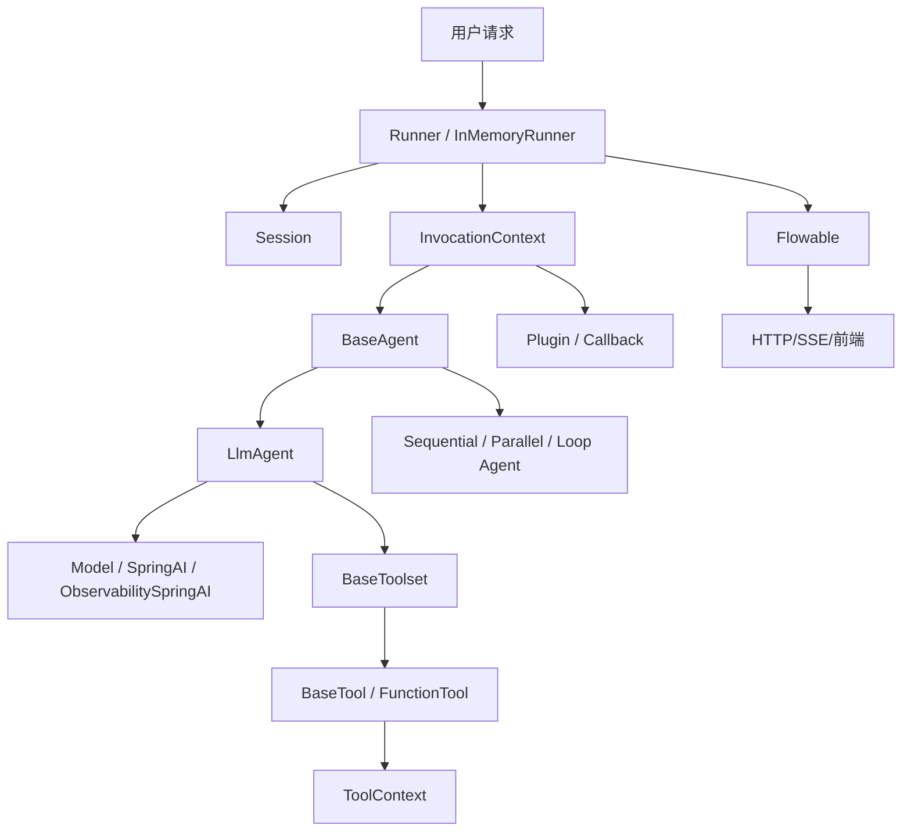
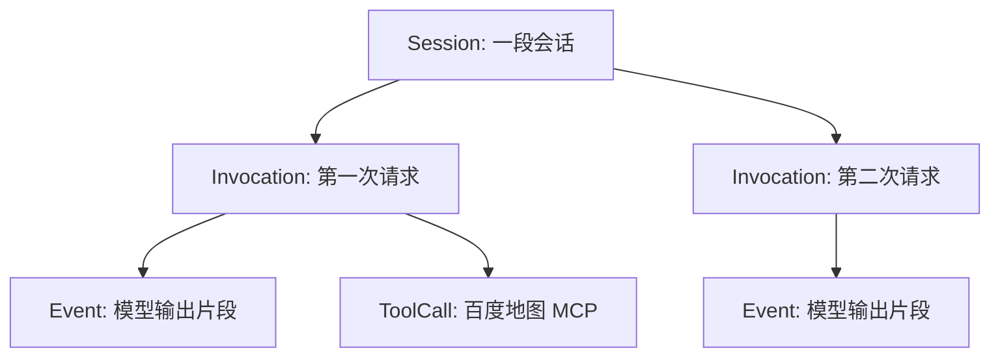
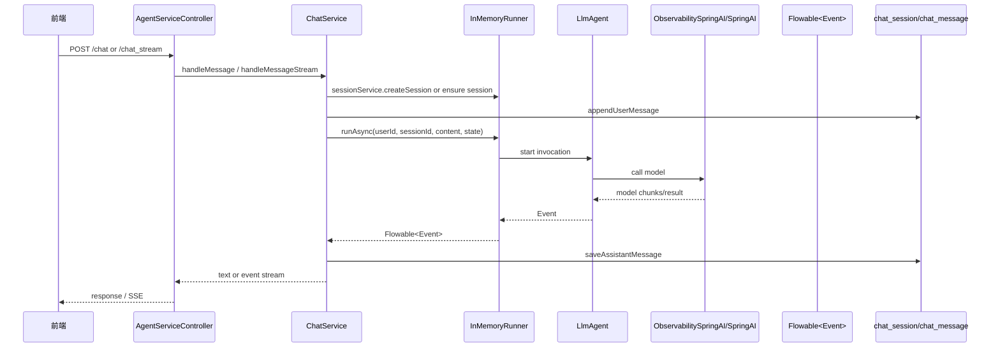
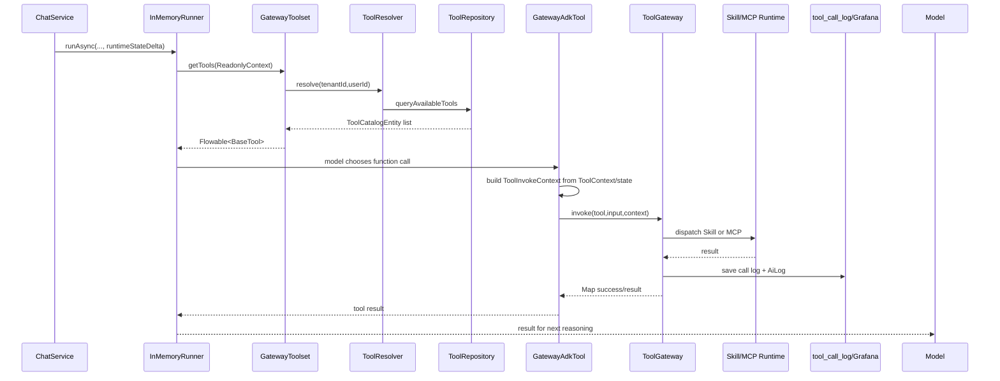
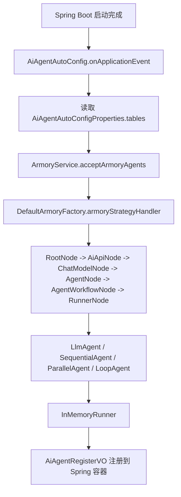
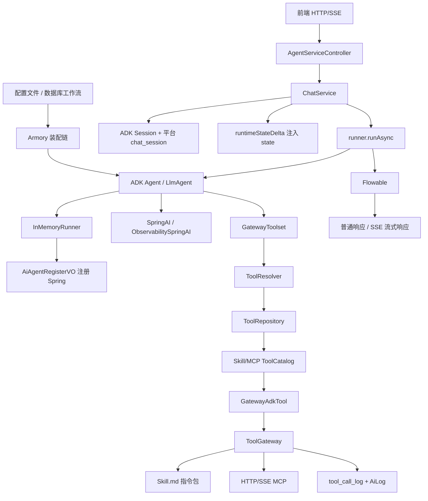

# Google ADK 在本项目里的基础能力闭环讲解

这份说明不是官方文档翻译，而是帮你建立一个能读源码、能继续设计平台的心智模型。

你可以先记住一句话：

**Google ADK 是一套 Agent 运行时框架。它帮你把模型、工具、会话、事件流、多 Agent 编排、插件回调这些东西组织起来。**

如果只直接调用大模型接口，你得到的是：

```text
用户输入 -> 模型接口 -> 模型回复
```

但 ADK 帮你组织成：

```text
用户输入
 -> Runner 创建一次运行 Invocation
 -> Agent 根据自身 instruction/model/tools 执行
 -> 过程中可能调用 Tool
 -> 产生 Event 流
 -> 写入 Session 状态
 -> Plugin/Callback 观察运行过程
 -> 返回最终回复
```

它不是单纯的“调模型 SDK”，更像是一个 **Agent 执行引擎**。

## 1. 先用一个形象模型理解 ADK

可以把 ADK 想象成一个剧场系统。

```text
Agent           = 演员 / 导演
LlmAgent        = 会调用大模型的演员
SequentialAgent = 按顺序安排演员上场的导演
ParallelAgent   = 让多个演员同时上场的导演
LoopAgent       = 让演员循环排练的导演

Runner          = 舞台经理，负责开场、调度、收集演出记录
Session         = 同一个观众的一本剧本本，记录长期上下文和 state
Invocation      = 某一次正式开演
Event           = 演出过程中的每一帧记录
Tool            = 道具 / 外部能力
Toolset         = 道具库
State           = 后台共享白板
Plugin          = 场务监听器，能观察演出前后发生了什么
```

一次聊天可以类比成：

```text
用户说一句话
= 观众给舞台经理一张任务卡

Runner
= 舞台经理安排一次演出 invocation

Agent
= 演员根据 instruction 和当前剧本状态表演

Tool
= 演员需要查地图、查数据库、读 Skill 时，去拿道具

Event
= 表演过程中的一句句台词、工具调用、模型片段

Session
= 演出结束后，把关键状态写回剧本本
```

这就是 ADK 的核心抽象。

## 2. ADK 核心对象总览



这个图里最重要的是：

```text
Runner 是运行入口
Agent 是执行主体
Session 是上下文容器
Invocation 是一次运行上下文
Event 是输出过程
Tool 是模型可调用能力
Plugin 是观测点
```

## 3. 本项目依赖了哪些 ADK 模块

依赖入口：

```text
/Users/codeliu/项目根据地/ai脚手架/Agent-Project/pom.xml
```

你项目里主要用了：

```xml
com.google.adk:google-adk
com.google.adk:google-adk-dev
com.google.adk:google-adk-spring-ai
com.google.adk.samples:google-adk-sample-helloworld
com.google.adk:google-adk-contrib-langchain4j
```

含义大概是：

```text
google-adk
核心 Agent / Runner / Session / Tool / Event 能力。

google-adk-spring-ai
把 Spring AI 的 ChatModel 接到 ADK 的模型接口里。

google-adk-dev
开发辅助能力。

google-adk-sample-helloworld
示例。

google-adk-contrib-langchain4j
LangChain4j 相关扩展，本项目当前主链路不靠它。
```

本项目最关键的是：

```text
google-adk
google-adk-spring-ai
```

## 4. ADK 原生能力在测试里怎么看

你应该先看测试。因为测试最接近 ADK 原生写法，没有太多你项目自己的封装。

### 4.1 SequentialAgentTest：串行编排

文件：

```text
/Users/codeliu/项目根据地/ai脚手架/Agent-Project/ai-agent-scaffold-app/src/test/java/cn/bugstack/ai/test/api/agent/SequentialAgentTest.java
```

它展示的是：

```text
LlmAgent A
 -> LlmAgent B
 -> LlmAgent C
```

也就是多个 Agent 按顺序执行。

适合这种场景：

```text
先写代码
再审查代码
再重构代码
```

概念关系：

```text
SequentialAgent extends BaseAgent
SequentialAgent 里面有 subAgents
每个 subAgent 可以是 LlmAgent
Runner 运行 SequentialAgent 时，会依次运行子 Agent
```

形象理解：

```text
SequentialAgent 是流水线导演。
他说：你先上，你演完他再上，最后第三个人上。
```

### 4.2 ParallelAgentTest：并行编排

文件：

```text
/Users/codeliu/项目根据地/ai脚手架/Agent-Project/ai-agent-scaffold-app/src/test/java/cn/bugstack/ai/test/api/agent/ParallelAgentTest.java
```

它展示的是：

```text
多个 LlmAgent 同时执行
然后由另一个 Agent 汇总
```

适合这种场景：

```text
一个 Agent 查市场
一个 Agent 查技术
一个 Agent 查竞品
最后一个 Agent 汇总
```

概念关系：

```text
ParallelAgent extends BaseAgent
ParallelAgent 里面有多个 subAgents
多个 subAgents 可以并行跑
```

形象理解：

```text
ParallelAgent 是分组导演。
他说：你们三个同时去调研，回来后汇报。
```

### 4.3 LoopAgentTest：循环编排

文件：

```text
/Users/codeliu/项目根据地/ai脚手架/Agent-Project/ai-agent-scaffold-app/src/test/java/cn/bugstack/ai/test/api/agent/LoopAgentTest.java
```

它展示的是：

```text
某些 Agent 反复执行
直到达到次数或工具触发退出
```

你之前问的 ReAct、先思考再执行，其实和 Loop 思想有关系：

```text
思考
行动
观察
再思考
再行动
```

概念关系：

```text
LoopAgent extends BaseAgent
LoopAgent 里面有 subAgents
可以通过工具或状态控制退出
```

形象理解：

```text
LoopAgent 是排练导演。
他说：这段不满意，再来一遍，直到满足条件。
```

## 5. Agent 是什么

ADK 里的 `Agent` 是执行主体。

它不是一定等于“大模型”。更准确地说：

```text
Agent = 一个可被 Runner 调度的执行单元
```

有些 Agent 会调用模型，比如：

```text
LlmAgent
```

有些 Agent 只是编排别的 Agent，比如：

```text
SequentialAgent
ParallelAgent
LoopAgent
```

父子关系可以理解为：

```text
BaseAgent
├── LlmAgent
├── SequentialAgent
├── ParallelAgent
└── LoopAgent
```

在本项目里，最重要的 Agent 构建入口是：

```text
/Users/codeliu/项目根据地/ai脚手架/Agent-Project/ai-agent-scaffold-domain/src/main/java/cn/bugstack/ai/domain/agent/service/armory/node/AgentNode.java
```

关键代码：

```java
LlmAgent.builder()
    .name(agentConfig.getName())
    .description(agentConfig.getDescription())
    .model(new ObservabilitySpringAI(chatModel, agentModelName))
    .instruction(agentConfig.getInstruction())
    .outputKey(agentConfig.getOutputKey())
    .tools(gatewayToolset)
    .build();
```

这段代码说明本项目的普通 Agent 是：

```text
ADK LlmAgent
+ Spring AI 模型适配
+ instruction
+ outputKey
+ GatewayToolset
```

也就是说：

```text
配置文件 / 数据库工作流节点
 -> AgentNode
 -> LlmAgent
```

## 6. LlmAgent 是什么

`LlmAgent` 是 ADK 里最像“智能体”的东西。

它通常包括：

```text
name
description
instruction
model
tools
outputKey
```

你可以把它理解成：

```text
一个带人格/任务说明/模型/工具的模型执行单元
```

在本项目里，`LlmAgent` 有两种来源。

第一种：配置里的系统 Agent。

流程是：

```text
读取 AiAgentConfigTableVO.Module.Agent
 -> 构建 ChatModel
 -> 构建 LlmAgent
 -> 放入 dynamicContext.agentGroup
```

第二种：数据库工作流节点编译出来的 Agent。

位置：

```text
/Users/codeliu/项目根据地/ai脚手架/Agent-Project/ai-agent-scaffold-domain/src/main/java/cn/bugstack/ai/domain/workflow/service/WorkflowRuntimeCompiler.java
```

这里把工作流中的每个 LLM 节点转成一个 ADK Agent 配置。

也就是：

```text
数据库 workflow_node
 -> WorkflowRuntimeCompiler
 -> AiAgentConfigTableVO.Module.Agent
 -> AgentNode
 -> LlmAgent
```

## 7. Runner 是什么

`Runner` 是 ADK 的运行器。

你可以把它理解成：

```text
负责启动 Agent、管理 Session、返回 Event 流的执行器
```

本项目用的是：

```java
InMemoryRunner
```

构建入口：

```text
/Users/codeliu/项目根据地/ai脚手架/Agent-Project/ai-agent-scaffold-domain/src/main/java/cn/bugstack/ai/domain/agent/service/armory/node/RunnerNode.java
```

关键代码：

```java
return new InMemoryRunner(baseAgent, appName, plugins);
```

这说明一个 Runner 包含：

```text
root BaseAgent
appName
plugins
```

形象理解：

```text
Runner 是舞台经理。
他知道这场戏用哪个主 Agent，当场戏属于哪个 appName，要挂哪些插件。
```

## 8. Session 是什么

`Session` 是 ADK 的会话。

它代表：

```text
同一个 userId 在同一个 appName 下的一段对话上下文
```

本项目里创建 ADK Session 的地方：

```text
/Users/codeliu/项目根据地/ai脚手架/Agent-Project/ai-agent-scaffold-domain/src/main/java/cn/bugstack/ai/domain/agent/service/ChatService.java
```

关键代码：

```java
Session session = runner.sessionService()
    .createSession(appName, userId)
    .blockingGet();
```

然后本项目又把这个 `session.id()` 写入自己的数据库会话表：

```text
ADK Session
 -> session.id()
 -> chat_session.session_id
```

所以你项目里有两层 session：

```text
ADK Session
负责 ADK 内部运行状态、state、模型上下文。

平台 chat_session
负责数据库持久化、租户隔离、审计、消息落库。
```

这点很重要。

ADK 自己的 `InMemoryRunner` 默认是内存会话，服务重启会丢。

你们新增的 `chat_session` / `chat_message` 是平台持久化层，用来补足企业级能力。

## 9. Invocation 是什么

`Invocation` 是一次 Agent 运行。

它比 session 小一层。

```text
Session = 一整段聊天
Invocation = 这段聊天里的某一次请求
Event = 这次请求里产生的一条条事件
```

例如：

```text
sessionId = S1

用户第一次问：“北京到南昌多远？”
invocationId = I1

用户第二次问：“那开车要多久？”
invocationId = I2
```

这两个 invocation 属于同一个 session。

你可以这样理解层级：



`InvocationContext` 就是 ADK 在一次运行过程中传递的上下文对象。

它通常能拿到：

```text
session
userId
appName
invocationId
state
```

本项目不直接大量操作 `InvocationContext`，但通过：

```text
ReadonlyContext
ToolContext
CallbackContext
```

间接使用它。

## 10. Event 是什么

`Event` 是 ADK 的运行事件。

本项目聊天时不是直接返回字符串，而是拿到：

```java
Flowable<Event>
```

关键代码：

```java
Flowable<Event> events = runner.runAsync(...)
```

非流式时：

```java
events.blockingForEach(event -> outputs.add(event.stringifyContent()));
```

流式时：

```java
RunConfig.builder()
    .streamingMode(RunConfig.StreamingMode.SSE)
    .build();
```

然后返回 `Flowable<Event>` 给 Controller，由 Controller 推 SSE 给前端。

所以：

```text
Event 是 ADK 的输出单位
Flowable<Event> 是 ADK 的事件流
event.stringifyContent() 是把事件内容转成文本
```

形象理解：

```text
Event 不是最终答案，而是演出过程中的每一帧。
```

## 11. State 是什么

`state` 是 ADK session 里的共享状态表。

本质是：

```java
Map<String, Object>
```

它用于在：

```text
Runner
Agent
Toolset
Tool
Plugin
Callback
```

之间传递运行时上下文。

本项目往 state 里塞的位置：

```text
/Users/codeliu/项目根据地/ai脚手架/Agent-Project/ai-agent-scaffold-domain/src/main/java/cn/bugstack/ai/domain/agent/service/ChatService.java
```

方法：

```java
runtimeStateDelta(...)
```

里面放了：

```text
traceId
tenantId
userId
sessionId
workflowId
roleCode
```

这些 key 定义在：

```text
/Users/codeliu/项目根据地/ai脚手架/Agent-Project/ai-agent-scaffold-domain/src/main/java/cn/bugstack/ai/domain/tool/model/valobj/ToolRuntimeContextKeys.java
```

```java
TENANT_ID
USER_ID
SESSION_ID
WORKFLOW_ID
TRACE_ID
```

为什么 state 很关键？

因为 ToolGateway 不相信模型自己传身份。

工具权限靠：

```text
后端注入 ADK state
 -> GatewayToolset 从 state 取 tenantId/userId
 -> ToolResolver 查可用工具
```

所以 state 是：

```text
可信身份透传通道
```

## 12. Tool 是什么

ADK 里的 `Tool` 是模型可以调用的函数。

常见类型包括：

```text
FunctionTool
BaseTool 自定义实现
BaseToolset 动态工具集合
```

本项目的企业化工具接入不是直接用简单 `FunctionTool`，而是自己实现了：

```text
/Users/codeliu/项目根据地/ai脚手架/Agent-Project/ai-agent-scaffold-domain/src/main/java/cn/bugstack/ai/domain/tool/service/GatewayAdkTool.java
```

```java
public class GatewayAdkTool extends BaseTool
```

这说明：

```text
GatewayAdkTool 是 ADK BaseTool 的自定义实现
```

它做的事是：

```text
数据库里的 Skill/MCP 记录
 -> 包装成 ADK 能看懂的函数声明
 -> 模型可以选择调用
 -> runAsync 里转交 ToolGateway 执行
```

关键执行入口：

```java
public Single<Map<String, Object>> runAsync(Map<String, Object> args, ToolContext toolContext)
```

它会：

```text
读取模型传入参数
读取 ToolContext 中的 state
组装 ToolInvokeContextEntity
调用 toolGateway.invoke(...)
```

## 13. ToolContext 是什么

`ToolContext` 是工具执行时的上下文。

你可以理解为：

```text
模型真正调用某个工具时，ADK 给这个工具的一张“后台通行证”
```

里面能拿到：

```text
userId
sessionId
invocationId
state
```

本项目使用位置：

```text
/Users/codeliu/项目根据地/ai脚手架/Agent-Project/ai-agent-scaffold-domain/src/main/java/cn/bugstack/ai/domain/tool/service/GatewayAdkTool.java
```

方法：

```java
private ToolInvokeContextEntity invokeContext(ToolContext toolContext)
```

它从 `toolContext.state()` 中拿：

```text
tenantId
userId
sessionId
workflowId
traceId
```

如果 `toolContext` 为 null，则用 fallbackContext。

这就是之前你遇到 `toolContext null` 时我们修的原因：

```text
有些工具调用路径下 ADK 可能不给完整 ToolContext
所以我们在 GatewayToolset 创建 GatewayAdkTool 时先准备 fallbackContext
```

## 14. Toolset 是什么

`Toolset` 是工具集合。

ADK 每轮运行前，会问 Toolset：

```text
你这轮有哪些工具？
```

本项目实现了：

```text
/Users/codeliu/项目根据地/ai脚手架/Agent-Project/ai-agent-scaffold-domain/src/main/java/cn/bugstack/ai/domain/tool/service/GatewayToolset.java
```

```java
public class GatewayToolset implements BaseToolset
```

核心方法：

```java
public Flowable<BaseTool> getTools(ReadonlyContext readonlyContext)
```

它做了三件事：

```text
1. 从 readonlyContext.state() 读取 tenantId/userId/sessionId/traceId
2. 调 ToolResolver 查询当前用户有权限的工具
3. 把每个 ToolCatalogEntity 包装成 GatewayAdkTool
```

这就是你项目“工具统一分发”的核心。

为什么用 Toolset 比 Agent 固定绑定工具好？

因为：

```text
固定绑定工具：
发布新工具 -> 要改 Agent / 重建工作流

动态 Toolset：
发布新工具 -> 下一轮 getTools 自动可见
禁用工具 -> 下一轮 getTools 自动消失
权限变化 -> 下一轮按 tenantId/userId 重新过滤
```

## 15. ReadonlyContext 是什么

`ReadonlyContext` 是 ADK 给 Toolset 的只读上下文。

它不是工具执行上下文，而是：

```text
获取本轮可用工具时用的上下文
```

使用位置：

```text
/Users/codeliu/项目根据地/ai脚手架/Agent-Project/ai-agent-scaffold-domain/src/main/java/cn/bugstack/ai/domain/tool/service/GatewayToolset.java
```

```java
public Flowable<BaseTool> getTools(ReadonlyContext readonlyContext)
```

为什么是 readonly？

因为 Toolset 只是决定：

```text
这轮有哪些工具能被模型看到
```

它不应该随便修改 session state。

形象理解：

```text
ReadonlyContext 是道具库管理员看的“演出任务单”
ToolContext 是真正拿道具上台时的“使用凭证”
```

## 16. Plugin / Callback 是什么

Plugin 是 ADK 运行过程中的监听器。

它可以观察：

```text
模型调用前
模型调用后
模型出错
工具调用前后
Agent 运行过程
```

本项目的日志插件是：

```text
/Users/codeliu/项目根据地/ai脚手架/Agent-Project/ai-agent-scaffold-domain/src/main/java/cn/bugstack/ai/domain/agent/service/armory/matter/plugin/MyLogPlugin.java
```

它用于记录：

```text
token_usage
model_error
```

Plugin 是在哪里挂进去的？

```text
/Users/codeliu/项目根据地/ai脚手架/Agent-Project/ai-agent-scaffold-domain/src/main/java/cn/bugstack/ai/domain/agent/service/armory/node/RunnerNode.java
```

关键代码：

```java
return new InMemoryRunner(baseAgent, appName, plugins);
```

所以插件属于 Runner 运行层。

形象理解：

```text
Plugin 是场务人员。
演员上场、模型说话、模型失败，它都能记日志。
```

## 17. 一次普通聊天请求完整闭环



关键源码：

```text
HTTP 入口：
AgentServiceController

业务运行：
ChatService

ADK 运行：
runner.runAsync(...)

消息持久化：
SessionDomain
```

你应该重点看：

```text
/Users/codeliu/项目根据地/ai脚手架/Agent-Project/ai-agent-scaffold-domain/src/main/java/cn/bugstack/ai/domain/agent/service/ChatService.java
```

这里有非流式执行、流式执行、DAG 执行、state 注入。

## 18. 一次工具调用完整闭环



这里最重要的三个文件：

```text
/Users/codeliu/项目根据地/ai脚手架/Agent-Project/ai-agent-scaffold-domain/src/main/java/cn/bugstack/ai/domain/tool/service/GatewayToolset.java

/Users/codeliu/项目根据地/ai脚手架/Agent-Project/ai-agent-scaffold-domain/src/main/java/cn/bugstack/ai/domain/tool/service/GatewayAdkTool.java

/Users/codeliu/项目根据地/ai脚手架/Agent-Project/ai-agent-scaffold-domain/src/main/java/cn/bugstack/ai/domain/tool/service/ToolGateway.java
```

## 19. ToolGateway 和 ADK Tool 的关系

父子/实现关系：

```text
ADK BaseTool
└── 本项目 GatewayAdkTool

ADK BaseToolset
└── 本项目 GatewayToolset

本项目 GatewayAdkTool
└── 调用 ToolGateway

本项目 ToolGateway
├── invokeSkill
└── invokeMcp
```

也就是说：

```text
ADK 只认识 BaseTool/BaseToolset
本项目把数据库工具包装成 BaseTool
真正执行交给自己的 ToolGateway
```

这个设计非常关键，因为它把 ADK 和你的企业工具系统解耦了。

## 20. Workflow 在 ADK 中怎么表达

ADK 原生有：

```text
SequentialAgent
ParallelAgent
LoopAgent
```

但你们现在新增了数据库 DAG 工作流。

它不是直接用 ADK 的 `ParallelAgent` / `LoopAgent` 组合所有节点，而是：

```text
数据库画布 graph
 -> WorkflowRuntimeCompiler
 -> 每个节点编译成一个 LlmAgent 配置
 -> ChatService 自己按 DAG 拓扑顺序运行每个节点 Agent
```

关键文件：

```text
/Users/codeliu/项目根据地/ai脚手架/Agent-Project/ai-agent-scaffold-domain/src/main/java/cn/bugstack/ai/domain/workflow/service/WorkflowRuntimeCompiler.java
```

它输出：

```text
WorkflowDagCompileResultEntity
  - tables: 每个节点对应的 AiAgentConfigTableVO
  - dagPlan: DAG 执行计划
```

真正执行 DAG 的地方：

```text
/Users/codeliu/项目根据地/ai脚手架/Agent-Project/ai-agent-scaffold-domain/src/main/java/cn/bugstack/ai/domain/agent/service/ChatService.java
```

方法：

```java
executeDagPlan(...)
runDagNodeOnce(...)
```

这里最终还是调用：

```java
runner.runAsync(...)
```

所以结论是：

```text
工作流编排是你们自己做的
节点执行仍然交给 ADK Agent + Runner
```

## 21. ADK 原生编排和你们 DAG 编排的区别

```text
ADK SequentialAgent
适合固定顺序的子 Agent 编排。

ADK ParallelAgent
适合固定并行子 Agent 编排。

ADK LoopAgent
适合固定循环子 Agent 编排。

你们的 DAG 编排
适合用户在前端画布动态创建节点和箭头，然后存数据库，运行时再编译执行。
```

所以不是谁替代谁，而是层次不同：

```text
ADK 原生编排 = 代码级编排
你们 DAG 编排 = 产品级 / 数据库级 / 用户可视化编排
```

你们的 DAG 最终还是借 ADK 执行节点能力。

## 22. 项目启动后 Agent 是怎么装配出来的



入口文件：

```text
/Users/codeliu/项目根据地/ai脚手架/Agent-Project/ai-agent-scaffold-app/src/main/java/cn/bugstack/ai/config/AiAgentAutoConfig.java
```

它会调用：

```text
/Users/codeliu/项目根据地/ai脚手架/Agent-Project/ai-agent-scaffold-domain/src/main/java/cn/bugstack/ai/domain/agent/service/armory/ArmoryService.java
```

装配上下文在：

```text
/Users/codeliu/项目根据地/ai脚手架/Agent-Project/ai-agent-scaffold-domain/src/main/java/cn/bugstack/ai/domain/agent/service/armory/factory/DefaultArmoryFactory.java
```

里面的 `DynamicContext` 放：

```text
openAiApi
chatModel
chatModelName
toolCallbacks
agentGroup
currentAgentWorkflow
dataObjects
```

这个 `DynamicContext` 是你项目的装配期上下文，不是 ADK 的运行时 context。

## 23. 装配期 Context 和运行期 State 不要混淆

你项目里有两个容易混淆的东西。

第一个是装配期上下文：

```text
DefaultArmoryFactory.DynamicContext
```

用于：

```text
Spring Boot 启动时
把配置表变成 Agent / Runner
```

第二个是 ADK 运行期 state：

```text
ChatService.runtimeStateDelta(...)
```

用于：

```text
每一次 runner.runAsync 时
把 tenantId/userId/sessionId/traceId 传给 Agent/Tool
```

简单区分：

```text
DynamicContext = 装配期，建 Agent 用
state = 运行期，每次请求传身份和链路信息用
```

## 24. 为什么一次聊天不是直接调模型

因为如果直接调模型，你只能做：

```text
prompt -> model -> response
```

但 ADK 的 `runner.runAsync(...)` 可以让你获得：

```text
Session 管理
Invocation 管理
Event 流
Tool 调用
Plugin 回调
多 Agent 编排
state 透传
模型输出观测
```

本项目选择 ADK 的意义就在这里：

```text
它提供 Agent 运行骨架
你们在骨架上加企业能力
```

比如：

```text
多租户身份
会话持久化
工具权限
ToolGateway
Grafana 日志
数据库工作流
动态模型路由
```

这些如果直接调模型，会散落在各个业务代码里。

## 25. 本项目哪些是 ADK 原生能力

ADK 原生能力：

```text
BaseAgent
LlmAgent
SequentialAgent
ParallelAgent
LoopAgent
InMemoryRunner
Session
InvocationContext
ReadonlyContext
ToolContext
BaseTool
BaseToolset
FunctionTool
Event
Flowable<Event>
Plugin
RunConfig
```

本项目直接使用 ADK 的位置：

```text
AgentNode 构建 LlmAgent
RunnerNode 构建 InMemoryRunner
ChatService 调 runner.runAsync
GatewayToolset 实现 BaseToolset
GatewayAdkTool 继承 BaseTool
MyLogPlugin 作为 ADK plugin
测试类使用 Sequential/Parallel/Loop Agent
```

## 26. 本项目基于 ADK 做了哪些封装

项目封装层：

```text
AiAgentConfigTableVO
把配置文件/数据库工作流转换成统一配置表。

ArmoryService + DefaultArmoryFactory
把配置表装配成 ADK Agent 和 Runner。

AiAgentRegisterVO
把 appName、agentId、runner 注册到 Spring 容器。

ObservabilitySpringAI
把模型调用和观测能力包起来。

ChatService
把 HTTP 请求变成 ADK runner.runAsync，并负责会话和消息持久化。

GatewayToolset / GatewayAdkTool / ToolGateway
把企业工具系统接入 ADK Tool 体系。

WorkflowRuntimeCompiler
把数据库工作流编译成 ADK 可运行配置。
```

## 27. 本项目新增的企业平台能力

这些不是 ADK 原生提供的，是你们自己做的企业化增强：

```text
JWT 身份链路
TenantContextHolder
会话持久化 chat_session
消息持久化 chat_message
Skill/MCP 发布管理
MinIO Skill 包存储
ToolGateway 统一分发
tool_call_log 审计
Grafana/Loki 可观测日志
数据库工作流 DAG 编排
动态模型路由
租户/用户/角色权限模型
```

ADK 提供的是“运行骨架”。

你们做的是“企业平台外壳和治理能力”。

## 28. 推荐源码阅读路线

### 第一遍：先看 ADK 原生示例

读这三个：

```text
/Users/codeliu/项目根据地/ai脚手架/Agent-Project/ai-agent-scaffold-app/src/test/java/cn/bugstack/ai/test/api/agent/SequentialAgentTest.java

/Users/codeliu/项目根据地/ai脚手架/Agent-Project/ai-agent-scaffold-app/src/test/java/cn/bugstack/ai/test/api/agent/ParallelAgentTest.java

/Users/codeliu/项目根据地/ai脚手架/Agent-Project/ai-agent-scaffold-app/src/test/java/cn/bugstack/ai/test/api/agent/LoopAgentTest.java
```

目标：

```text
先知道 ADK 自己怎么创建 Agent、Runner、Session、Event。
```

### 第二遍：看项目怎么装配 Agent

按顺序读：

```text
/Users/codeliu/项目根据地/ai脚手架/Agent-Project/ai-agent-scaffold-app/src/main/java/cn/bugstack/ai/config/AiAgentAutoConfig.java

/Users/codeliu/项目根据地/ai脚手架/Agent-Project/ai-agent-scaffold-domain/src/main/java/cn/bugstack/ai/domain/agent/service/armory/ArmoryService.java

/Users/codeliu/项目根据地/ai脚手架/Agent-Project/ai-agent-scaffold-domain/src/main/java/cn/bugstack/ai/domain/agent/service/armory/factory/DefaultArmoryFactory.java

/Users/codeliu/项目根据地/ai脚手架/Agent-Project/ai-agent-scaffold-domain/src/main/java/cn/bugstack/ai/domain/agent/service/armory/node/AgentNode.java

/Users/codeliu/项目根据地/ai脚手架/Agent-Project/ai-agent-scaffold-domain/src/main/java/cn/bugstack/ai/domain/agent/service/armory/node/RunnerNode.java
```

目标：

```text
理解配置如何变成 ADK LlmAgent 和 InMemoryRunner。
```

### 第三遍：看一次 HTTP 聊天怎么跑起来

按顺序读：

```text
/Users/codeliu/项目根据地/ai脚手架/Agent-Project/ai-agent-scaffold-trigger/src/main/java/cn/bugstack/ai/trigger/http/AgentServiceController.java

/Users/codeliu/项目根据地/ai脚手架/Agent-Project/ai-agent-scaffold-domain/src/main/java/cn/bugstack/ai/domain/agent/service/ChatService.java
```

重点方法：

```text
handleMessage
handleMessageStream
runtimeStateDelta
```

目标：

```text
理解请求如何变成 runner.runAsync。
理解 sessionId、traceId、tenantId 怎么进入 ADK state。
```

### 第四遍：看工具系统怎么接入 ADK

按顺序读：

```text
/Users/codeliu/项目根据地/ai脚手架/Agent-Project/ai-agent-scaffold-domain/src/main/java/cn/bugstack/ai/domain/tool/service/GatewayToolset.java

/Users/codeliu/项目根据地/ai脚手架/Agent-Project/ai-agent-scaffold-domain/src/main/java/cn/bugstack/ai/domain/tool/service/GatewayAdkTool.java

/Users/codeliu/项目根据地/ai脚手架/Agent-Project/ai-agent-scaffold-domain/src/main/java/cn/bugstack/ai/domain/tool/service/ToolGateway.java

/Users/codeliu/项目根据地/ai脚手架/Agent-Project/ai-agent-scaffold-infrastructure/src/main/java/cn/bugstack/ai/infrastructure/adapter/repository/ToolRepository.java
```

目标：

```text
理解 Toolset 动态加载工具。
理解 BaseTool 怎么包装数据库工具。
理解模型调用工具后怎么统一分发。
```

### 第五遍：看数据库工作流怎么落到 ADK

按顺序读：

```text
/Users/codeliu/项目根据地/ai脚手架/Agent-Project/ai-agent-scaffold-domain/src/main/java/cn/bugstack/ai/domain/workflow/service/WorkflowDomainService.java

/Users/codeliu/项目根据地/ai脚手架/Agent-Project/ai-agent-scaffold-domain/src/main/java/cn/bugstack/ai/domain/workflow/service/WorkflowRuntimeCompiler.java

/Users/codeliu/项目根据地/ai脚手架/Agent-Project/ai-agent-scaffold-domain/src/main/java/cn/bugstack/ai/domain/agent/service/ChatService.java
```

目标：

```text
理解工作流不是直接等于 ADK 原生 Agent 编排。
它是数据库图 -> 编译 -> 多个 ADK Agent -> 自己按 DAG 执行。
```

## 29. 最后一张总图：你项目的 ADK 闭环



你读源码时只要抓住这条线：

```text
配置如何变 Agent
Agent 如何变 Runner
HTTP 如何触发 Runner
Runner 如何产生 Event
state 如何传身份
Toolset 如何动态给工具
ToolGateway 如何统一执行
```

基本就能掌握 ADK 在这个项目里的全貌。

## 30. 你现在最应该先理解的五个概念

如果只先吃透五个，我建议按这个顺序：

```text
1. LlmAgent
因为它是最核心的执行单元。

2. InMemoryRunner
因为所有运行都从 runner.runAsync 开始。

3. Session / State
因为会话、工具权限、trace 都靠它串起来。

4. Event / Flowable<Event>
因为流式输出、模型中间过程都靠它表达。

5. BaseToolset / BaseTool
因为你们的 Skill/MCP 企业工具体系就是挂在这里。
```

一句话结论：

**ADK 给你的是 Agent 运行时骨架；你们项目正在把它扩展成企业级 Agent 平台。**
