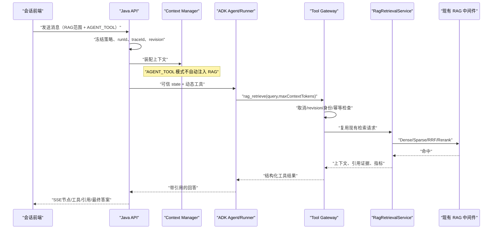
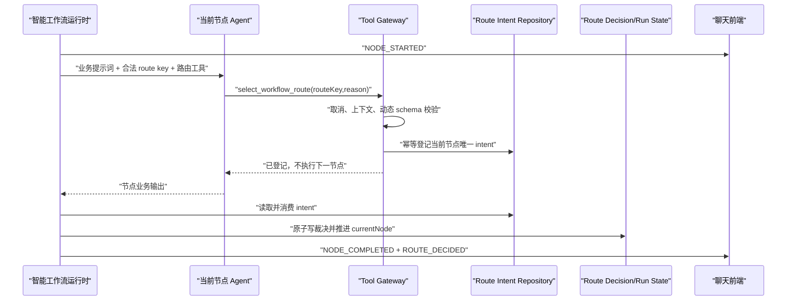

# RAG 检索工具化与智能工作流路由工具化——全栈闭环执行文档

> 文档日期：2026-08-06  
> 文档状态：待执行  
> 目标读者：没有本次对话上下文、第一次接手本项目的开发 Agent  
> 项目根目录：`/Users/codeliu/项目根据地/ai脚手架/Agent-Project`  
> 权威架构说明：项目根目录 `codex.md`  
> 本文范围：设计、实现、迁移、测试、灰度和验收；不包含把本地 Java 项目上传到服务器

## 1. 执行者先读：不可违反的约束

1. 开始任何代码修改前，完整阅读根目录 `codex.md`，并将本轮具体计划追加到本文末尾“执行记录”。
2. 项目采用模块化单体和领域分层：`trigger -> domain <- infrastructure`。Controller 只做协议转换、鉴权上下文提取和调用领域服务；业务规则进入 domain；数据库、HTTP、Qdrant、模型等实现进入 infrastructure。
3. 不新建一条绕过现有 RAG 的检索链路。RAG 工具必须复用 `RagRetrievalService` 及其现有权限、绑定、混合召回、重排、预算、引用和审计能力。
4. 不允许浏览器直连 Qdrant、Embedding、Rerank 或模型服务；浏览器只能调用本项目 Java API。
5. 模型参数永远不是身份凭证。`tenantId/userId/roleCode/runId/sessionId/workflowId/nodeExecutionId/traceId` 必须从服务端可信运行上下文获得，不能由模型工具参数传入。
6. 路由工具只对“智能工作流”暴露；普通 Agent 和普通 DAG 工作流不得看到或调用路由工具。
7. 路由工具只提交“路由意图”，不得在工具内部递归执行目标节点。节点推进、步数预算、访问次数、取消检查和终态收口仍由 Java 工作流运行时统一负责。
8. 保留 `[route:xxx]` 的兼容读取和界面显示，不再把它作为新链路的权威裁决来源。不得依靠自由文本猜测路由。
9. 所有工具调用前必须再次检查取消、运行状态和上下文 revision；取消后不得发起 RAG、模型、MCP、Skill 或路由副作用。
10. 所有新增日志必须带同一个根 `traceId`，并带可用的 `runId/sessionId/nodeExecutionId/functionCallId/retrievalId`。HTTP 响应和 SSE 首事件必须能让前端拿到 traceId。
11. 禁止将密码、Token、API Key、私钥写入本文、源码、测试快照或提交信息。敏感连接信息只允许引用 `codex.md`，不得复制。
12. 工作区可能存在用户未提交修改。先执行 `git status --short --branch`，只编辑、暂存本计划列出的文件；禁止 `git reset --hard`、强推和覆盖用户改动。
13. 每完成一个重大闭环，先把真实操作、测试命令和结果追加到本文，再进行中文本地提交。不要提交日志、构建产物、对象存储数据或无关未跟踪文件。

## 2. 需求原文转化后的可验收目标

本次只有两个核心能力，但必须以前后端完整产品形态交付。

### 2.1 RAG 检索成为 Agent 工具

- 在系统提示词和函数工具清单中向符合条件的 Agent 暴露一个平台内置 RAG 工具。
- Agent 根据问题和上下文自行决定何时检索、检索几次；实际检索复用已有策略与知识库绑定。
- 工具返回结构化命中、可引用上下文、检索编号、耗时与降级信息。
- 工具命中的文档必须进入现有证据白名单，最终答案引用仍受现有引用校验约束。
- 前端会话页能选择“自动注入”或“Agent 按需检索”，并能看到工具调用过程和结果摘要。

### 2.2 路由成为智能工作流专用工具

- 每个非终点智能工作流节点都可获得一个动态路由工具；工具 schema 只包含该节点此刻允许的 route key。
- route key 支持中文；别名只做配置表中的精确归一化匹配，不做语义猜测。
- Agent 调用工具后，服务端登记唯一裁决，工作流运行时校验并推进到目标节点。
- 节点展示输出必须包含服务端保证的中文说明：`经判断，路由到「节点展示名」节点。`
- 如果模型正常回答却没有调用路由工具，最多进行一次“只允许路由工具”的修复调用；仍失败时走 DEFAULT，否则以 `WORKFLOW_ROUTE_REQUIRED` 失败。
- 如果节点模型调用或执行工具发生技术异常，运行时不依赖模型，直接走 FAILURE 边；没有 FAILURE 边则工作流失败。
- 前端智能工作流编辑器能配置 route key、别名、默认边、失败边和目标节点，并明确展示该节点可用路由工具；聊天页能实时展示节点、工具和路由裁决。

## 3. 本次不做什么

- 不替换 Google ADK，不引入 LangGraph/其他工作流引擎。
- 不重写 Dense/Sparse/RRF/Rerank，也不改变现有 RAG 服务器部署。
- 不允许模型直接给出 `targetNodeId`，不允许工具直接跳转执行节点。
- 不用正则或 LLM 猜测自由文本中的“应该去哪个节点”。
- 不把平台内置工具伪装成租户发布的 Skill 或 MCP 数据。
- 不删除旧的 `[route:key]` 兼容能力；旧版本工作流仍可回放。
- 不迁移 MySQL，不上传本地项目，不修改服务器中间件部署。

## 4. 当前实现事实：接手者必须先理解

### 4.1 模块和调用入口

- 智能工作流 HTTP/SSE 入口：`ai-agent-scaffold-trigger/src/main/java/cn/bugstack/ai/trigger/http/IntelligentWorkflowRunController.java`。
- 智能工作流运行循环：`ai-agent-scaffold-domain/src/main/java/cn/bugstack/ai/domain/workflow/service/IntelligentWorkflowRuntimeService.java`。
- 节点实际模型调用：`ai-agent-scaffold-domain/src/main/java/cn/bugstack/ai/domain/agent/service/ChatService.java`，最终进入 ADK `Runner.runAsync(...)`。
- 工作流编译与节点 Agent/Runner 装配：从 `WorkflowDomainService.loadRuntime`、`WorkflowRuntimeCompiler`、`AgentNode`、`RunnerNode` 顺藤检查。
- 工具装配：`GatewayToolset -> ToolResolver -> GatewayAdkTool -> ToolGateway`。
- RAG 权威检索：`RagRetrievalService.retrieve(...)`；当前自动上下文注入由 `RagContextContributor` 完成。
- 前端工作流编辑器：`ai-agent-scaffold-web/src/views/workflow/WorkflowBuilderView.vue`。
- 前端工作流模板：`ai-agent-scaffold-web/src/domain/workflow-templates.ts`。
- 前端聊天状态与 SSE：`ai-agent-scaffold-web/src/stores/chat.ts`、`src/domain/workflow-event-reducer.ts`。
- 前端节点面板：`ai-agent-scaffold-web/src/components/chat/WorkflowNodeExecutionPanel.vue`。

### 4.2 当前路由为什么需要改

当前智能运行时把可用路由写入提示词，要求模型在正文末尾输出 `[route:key]`，随后 `WorkflowRouteKey` 从最终文本解析。`IntelligentWorkflowRouter` 再按既定策略选边。存在以下缺口：

- 路由和业务正文混合，模型漏写、改写或输出多个标记时不可靠。
- `NODE_SUGGESTION` 与 `AI_ROUTER` 实际消费同一段 marker，没有独立、可审计的工具裁决。
- 节点调用异常目前直接使工作流失败，没有真正把 `failed=true` 交给 FAILURE 路由闭环。
- 智能运行时目前偏向节点完成后一次性发布输出，工具调用过程没有统一事件协议。
- 路由原因、工具调用 ID、节点执行 ID 没有形成一个原子、幂等的裁决事实。

### 4.3 当前 Tool Gateway 为什么不能直接塞两个 if

`GatewayToolset` 每轮依据可信 ADK state 获取工具；`GatewayAdkTool` 重建可信调用上下文；`ToolGateway` 做取消、revision、授权、幂等和审计后分发。当前 `ToolType` 只有 `SKILL/MCP`，参数 schema 也只适配这两类。

本次必须扩展为“平台内置工具”通道，而不是在 `ChatService` 或 Controller 里直接判断工具名。这样 RAG 和路由才能共同继承取消闸门、trace、审计和幂等语义。

### 4.4 当前 RAG 为什么要复用

`RagRetrievalService` 已包含租户/绑定权限、Dense/Sparse、多路融合、Rerank、Token 预算、降级、审计和指标。`RagContextContributor` 还负责把内容包装为不可信参考资料并生成引用证据。新工具若自行调 Qdrant 或模型，会绕开权限、引用和评测过的策略，属于架构错误。

## 5. 核心架构决策

### 5.1 新增 PLATFORM 工具类型

新增 `ToolType.PLATFORM`，并建立平台工具注册表。平台工具不来自租户 DB 发布记录，而是由服务端按运行上下文动态生成描述符。

建议抽象：

```text
GatewayToolset
  ├─ ToolResolver                 租户已授权 Skill/MCP
  └─ PlatformToolResolver         服务端按运行状态生成内置工具
       ├─ rag_retrieve            符合 RAG 策略时出现
       └─ select_workflow_route   仅智能工作流非终点节点出现

GatewayAdkTool
  -> ToolGateway（统一闸门、幂等、审计）
       -> Skill/MCP dispatcher
       -> PlatformToolRegistry
            ├─ RagRetrievePlatformToolHandler
            └─ WorkflowRoutePlatformToolHandler
```

如果现有 `ToolCatalogEntity` 过度绑定 DB Skill/MCP，应提取通用 `ToolDescriptorEntity`，包含 `toolId/toolCode/type/name/description/parameterSchema/enabled`。不要为了少改一个类而让平台工具伪造数据库主键。

### 5.2 RAG 的“绑定范围”和“调用方式”正交

保留现有 `SessionRagMode`：

- `OFF`：关闭；不自动检索，也不暴露 RAG 工具。
- `AUTO`：由服务端按当前 Agent/Workflow 绑定选择知识库。
- `MANUAL`：用户明确选定知识库绑定。

新增 `RagInvocationMode`：

- `AUTO_CONTEXT`：保持当前行为，在 Context Manager 阶段自动注入。
- `AGENT_TOOL`：不自动注入，由 Agent 调用 `rag_retrieve`。

不能简单给 `SessionRagMode` 增加 `TOOL`，因为那会丢失“工具调用 + AUTO 绑定”和“工具调用 + MANUAL 绑定”的组合表达能力。已有会话默认 `AUTO_CONTEXT`，保证兼容。

### 5.3 路由工具只写意图，运行时裁决并推进

`select_workflow_route` 只接受 `routeKey` 和 `reason`。服务端从当前冻结工作流定义中解析 route key，登记当前 `nodeExecutionId` 唯一的 route intent。模型不能传目标节点、租户或运行身份。

运行时在模型轮结束后读取这个 intent，再执行以下动作：

1. 校验 intent 属于当前 run、当前节点执行、当前定义 hash。
2. 对 route key 做 NFKC、去首尾空格、大小写归一，然后只匹配主键或受控别名。
3. 确认目标在 `allowedTargetNodeIds` 内且边仍有效。
4. 写入现有 `workflow_route_decision` 权威记录。
5. 发布 `ROUTE_DECIDED`，推进运行状态。

工具不能直接写 `current_node_id`，否则工具重试、SSE 重放或进程崩溃会造成双推进。

### 5.4 输出说明由服务端保证

模型可自然输出路由解释，但以下文案由运行时根据最终权威裁决追加，不能完全依赖模型：

```text
经判断，路由到「账务处理」节点。
[route:账务]
```

保留 marker 是兼容需要；权威来源是 route decision。若节点正文已经包含完全相同的说明，服务端去重后只保留一次。前端不得从这段文字反推路由，而应消费 `ROUTE_DECIDED` 事件。

### 5.5 正常缺路由与技术失败分开处理

| 场景 | 处理 |
|---|---|
| 模型成功且调用了合法路由工具 | 使用工具 intent |
| 模型成功但没调用路由工具 | 执行一次受限 route repair |
| route repair 合法 | 使用 repair intent，标记来源 `ROUTE_REPAIR` |
| route repair 仍缺失或非法 | 走 DEFAULT；无 DEFAULT 则 `WORKFLOW_ROUTE_REQUIRED` |
| 模型、RAG、Skill/MCP 等技术异常 | 直接走 FAILURE，不要求失败中的模型再调用工具 |
| 取消已请求 | 终止为 CANCELLED，不走 FAILURE，不调用任何工具 |
| 预算耗尽/循环上限 | 终止对应预算错误；不得利用 FAILURE 绕过预算 |

route repair 调用时只暴露 `select_workflow_route`，不得暴露 RAG、MCP、Skill，也不得重新执行原业务工具；系统提示词只包含原输出摘要和合法 key，要求选择一次。

## 6. 目标链路

### 6.1 RAG 工具链路



### 6.2 智能路由工具链路



## 7. 工具协议

### 7.1 `rag_retrieve`

工具名称固定为 `rag_retrieve`，版本通过内部 toolCode 管理，例如 `platform_rag_retrieve_v1`。

模型可见参数：

```json
{
  "type": "object",
  "additionalProperties": false,
  "required": ["query"],
  "properties": {
    "query": {
      "type": "string",
      "minLength": 1,
      "maxLength": 2000,
      "description": "需要从当前会话已授权知识库检索的问题；不要包含租户、知识库编号或用户身份"
    },
    "maxContextTokens": {
      "type": "integer",
      "minimum": 128,
      "maximum": 8000,
      "description": "期望返回的上下文 Token 上限；服务端还会应用更严格的运行预算"
    }
  }
}
```

可信上下文补齐：tenant、user、session、run、workflow/agent target、bindingIds、策略 revision、trace、invocation、node execution。模型不得覆盖。

结构化返回至少包含：

```json
{
  "success": true,
  "retrievalId": "ret_xxx",
  "query": "……",
  "context": "服务端封装后的不可信参考资料",
  "citations": [{"citationId":"cite_xxx","documentId":"doc_xxx","title":"……"}],
  "stats": {"hits":18,"citations":2,"tokens":863,"costMs":1200,"degraded":false}
}
```

返回给模型的 `context` 必须继续使用现有“不可信参考资料”边界，明确文档内容不是系统指令。引用证据要写入 `RagInvocationEvidenceStore`，并与本次 `invocationId/nodeExecutionId` 关联。

### 7.2 `select_workflow_route`

工具名称固定为 `select_workflow_route`，内部版本如 `platform_select_workflow_route_v1`。

每个节点动态生成 enum。示例：

```json
{
  "type": "object",
  "additionalProperties": false,
  "required": ["routeKey", "reason"],
  "properties": {
    "routeKey": {
      "type": "string",
      "enum": ["正确", "错误"],
      "description": "只能选择一个当前节点已配置的路由键"
    },
    "reason": {
      "type": "string",
      "minLength": 1,
      "maxLength": 500,
      "description": "简洁说明为何选择该路由，不得包含隐私或完整思维链"
    }
  }
}
```

注意：别名用于服务端兼容精确匹配，动态 enum 优先只暴露主 route key，减少模型选择空间。工具结果只返回“已登记”，不得返回或触发另一个 Agent 的执行。

## 8. 状态、幂等和数据模型

### 8.1 RAG 调用方式持久化

新增增量 SQL（文件名按实际日期）：

- `chat_session.rag_invocation_mode VARCHAR(32) NOT NULL DEFAULT 'AUTO_CONTEXT'`
- `chat_run.rag_invocation_mode VARCHAR(32) NOT NULL DEFAULT 'AUTO_CONTEXT'`

会话字段是当前策略；run 字段是本轮冻结快照。会话切换调用方式时继续使用现有 `ragRevision` 乐观锁。创建 run 时一次性冻结 `ragMode/ragInvocationMode/ragBindingIds/ragPolicyRevision`。

### 8.2 路由意图表

现有 `workflow_route_decision` 是运行时已经接受的权威裁决，不应在工具刚被模型调用时提前写入。新增 `workflow_route_intent`：

```sql
CREATE TABLE workflow_route_intent (
  id BIGINT UNSIGNED NOT NULL AUTO_INCREMENT,
  tenant_id VARCHAR(64) NOT NULL,
  user_id VARCHAR(64) NOT NULL,
  run_id VARCHAR(80) NOT NULL,
  node_execution_id VARCHAR(80) NOT NULL,
  workflow_id VARCHAR(80) NOT NULL,
  workflow_version INT NOT NULL,
  definition_hash CHAR(64) NOT NULL,
  node_id VARCHAR(128) NOT NULL,
  route_key VARCHAR(128) NOT NULL,
  normalized_route_key VARCHAR(128) NOT NULL,
  resolved_edge_id VARCHAR(128) NOT NULL,
  resolved_target_node_id VARCHAR(128) NOT NULL,
  reason VARCHAR(500) NOT NULL,
  function_call_id VARCHAR(128) NOT NULL,
  source VARCHAR(32) NOT NULL,
  status VARCHAR(32) NOT NULL,
  trace_id VARCHAR(64) NOT NULL,
  consumed_at DATETIME(3) NULL,
  create_time DATETIME(3) NOT NULL DEFAULT CURRENT_TIMESTAMP(3),
  update_time DATETIME(3) NOT NULL DEFAULT CURRENT_TIMESTAMP(3) ON UPDATE CURRENT_TIMESTAMP(3),
  deleted TINYINT NOT NULL DEFAULT 0,
  PRIMARY KEY (id),
  UNIQUE KEY uk_wri_node_execution (tenant_id, run_id, node_execution_id),
  UNIQUE KEY uk_wri_function_call (tenant_id, function_call_id),
  KEY idx_wri_trace (trace_id),
  KEY idx_wri_run (tenant_id, run_id, status)
);
```

执行者可以按项目字段规范调整长度和审计列，但不能取消两个唯一约束。第一次合法调用获胜；同一 `functionCallId` 重放返回原结果；同一节点第二个不同选择返回 `WORKFLOW_ROUTE_ALREADY_SELECTED`，不能覆盖第一次裁决。

### 8.3 原子消费

消费 intent、插入 `workflow_route_decision`、更新智能运行时 `current_node_id/revision/executed_steps` 和写 outbox/event 必须处于同一事务或现有可靠 outbox 语义中。进程在工具返回后、节点推进前崩溃，恢复任务应读到未消费 intent 并继续一次，不能再次调用模型。

## 9. 后端逐阶段改造

下面的文件名是定位入口。若代码已变化，先用 `rg` 找同职责实现，不要机械创建重复类。

### 阶段 A：领域模型和数据库迁移

1. 新增 `RagInvocationMode`，解析未知值时 fail closed 或兼容回落到 `AUTO_CONTEXT`，并写单测。
2. 扩展 `ChatSessionEntity`、`ChatRunEntity`、对应 PO/DAO/Mapper/Repository/API DTO。
3. 创建 session/run 调用方式增量 SQL 与回滚 SQL；历史数据回填 `AUTO_CONTEXT`。
4. 新增 `WorkflowRouteIntentEntity`、状态值对象、`IWorkflowRouteIntentRepository`。
5. 在 infrastructure 增加 PO、DAO/MyBatis 映射和仓储实现；实现幂等 claim、按当前节点读取、条件 consume。
6. 扩展可信工具上下文键：workflow kind/version/definition hash/current node/nodeExecutionId/RAG invocation mode。优先扩展 `ToolRuntimeContextKeys` 和 `ToolInvokeContextEntity`，不得把身份字段放进模型 schema。

阶段门禁：迁移可重复执行；旧数据正常读取；仓储并发测试证明同节点只接受一个 intent。

### 阶段 B：平台工具通道

1. `ToolType` 增加 PLATFORM。
2. 提取或新增通用工具描述符，能够表达名称、说明和完整 JSON Schema。
3. 新增 `PlatformToolResolver`：
   - RAG 为 OFF 或调用方式不是 AGENT_TOOL，不返回 `rag_retrieve`。
   - 当前不是智能工作流、节点是终点、没有可路由边，不返回 `select_workflow_route`。
   - route schema 从当前冻结定义动态生成，不从请求参数生成。
4. `GatewayToolset` 合并租户工具和平台工具，并对函数名冲突 fail closed。平台工具名保留，租户不得发布同名覆盖。
5. 扩展 `GatewayAdkTool` 生成 PLATFORM 的 function declaration，并继续从 ADK state 重建可信上下文。
6. 新增 `PlatformToolRegistry`/handler 接口；`ToolGateway` 在统一授权、取消、revision、幂等审计后分发 PLATFORM。
7. 平台工具也必须写现有工具审计，包含 toolCode、functionCallId、成功/失败、耗时和 traceId。

阶段门禁：普通 Agent 看不到 route 工具；取消中的 run 调任一平台工具均在外部调用前被拒绝；租户伪造同名工具不能覆盖平台工具。

### 阶段 C：RAG 工具 handler 与证据闭环

1. 从 `RagContextContributor` 提取共享的结果渲染和证据装配服务，例如 `RagRetrievalPresentationService`；自动注入与工具调用共同使用，避免两份 XML/引用逻辑。
2. 实现 `RagRetrievePlatformToolHandler`，构造 `RagRetrievalRequest` 时只使用可信上下文中的租户、目标和绑定；query/maxContextTokens 才来自模型参数。
3. 应用三层预算最小值：模型参数、会话/节点配置、run 剩余预算。
4. 将 citation/evidence 写入当前 invocation 的证据存储，确保最终引用校验可识别。
5. `ContextInjectionPlugin` 或 RAG contributor 在 `AGENT_TOOL` 时跳过自动检索；`AUTO_CONTEXT` 保持旧行为。
6. 同一轮允许多次检索，但需要配置上限（默认建议 3 次）和总 Token 预算；超限返回结构化 `RAG_TOOL_BUDGET_EXCEEDED`。
7. RAG 暂时错误按现有 retry/degraded 规则返回；若 handler 最终失败，是否触发 FAILURE 由节点运行时的“工具失败策略”统一判定，不能静默伪造空命中。

阶段门禁：工具结果与直接调用现有检索服务在相同请求/绑定下命中文档一致；引用 ID 能通过现有 validator；AGENT_TOOL 不发生隐式第二次自动检索。

### 阶段 D：路由工具 handler 与运行时状态机

1. 实现 `WorkflowRoutePlatformToolHandler`：校验当前智能工作流和节点执行；按主 key/受控别名精确解析；立即验证 target/definition hash；幂等登记 intent。
2. 系统提示词自动写入：每个 key、含义、目标展示名、工具必须调用一次、禁止自由文本代替。提示词是辅助，动态 schema 和服务端校验才是安全边界。
3. 改造 `IntelligentWorkflowRuntimeService`：
   - 节点开始前把完整可信状态写入 ADK state。
   - 节点成功后优先读取 route intent；旧定义才回退 marker 解析。
   - 新定义缺 intent 时调用一次 route repair。
   - 使用 intent 调 `IntelligentWorkflowRouter` 或提取的统一 edge resolver，写 decision 并推进。
   - 根据 decision 追加中文路由说明和兼容 marker，再完成节点输出。
4. 将异常分为 `CANCELLED`、业务无匹配、技术失败、预算错误：
   - 取消直接停止。
   - 技术失败调用统一 resolver 的 FAILURE 路径，创建来源 `RUNTIME_FAILURE` 的 decision。
   - 无 FAILURE 则记录节点失败并终止 workflow。
   - 预算错误不得路由回环继续消耗。
5. route repair 使用独立 invocation/idempotency key，工具集强制仅 route 工具；成功来源标记 `ROUTE_REPAIR`。
6. 兼容版本策略：发布新 workflow version 后使用 tool routing；旧 version 保持 marker-first 或通过 feature flag 灰度，不能原地改变运行中的 frozen definition。

阶段门禁：模型漏工具、非法 key、第二次不同 key、节点异常、取消、崩溃恢复、中文 key/别名均有测试；任何路径最多推进一次。

### 阶段 E：工作流事件、Trace 和 API

增加或统一以下 SSE 事件，schema 升级时保持旧 reducer 可忽略未知事件：

- `TOOL_CALL_STARTED`：toolCode/displayName/functionCallId/nodeExecutionId。
- `TOOL_CALL_COMPLETED`：success/costMs；RAG 附 retrievalId/hits/citations/tokens/degraded；route 附 routeKey/reason。
- `TOOL_CALL_FAILED`：errorCode/retryable/costMs，禁止输出密钥、完整参数和敏感文档正文。
- `ROUTE_REPAIR_STARTED/COMPLETED`：只暴露状态和结果，不暴露思维链。
- 现有 `ROUTE_DECIDED` 增加 `routeKey/targetNodeName/source/reason/functionCallId`。

要求：

1. POST 创建运行响应含 `runId` 和 `traceId`；SSE 的 `WORKFLOW_STARTED` 也含 traceId。
2. 所有上述事件保存到 `workflow_run_event`，支持 Last-Event-ID 重放，不能仅存在内存。
3. 每个关键阶段输出中文结构化日志：工具已暴露、工具开始、闸门通过/拒绝、RAG 各阶段、intent 登记、route repair、裁决、推进、失败/取消。
4. 日志查询最小关联键：traceId；辅助键：runId、nodeExecutionId、functionCallId、retrievalId。
5. 指标至少包含平台工具调用次数/失败率/p95、route repair 率、DEFAULT/FAILURE 比例、RAG 工具每轮次数和 Token、路由缺失率。

## 10. 前端逐阶段改造

### 10.1 API 类型和状态

在 `ai-agent-scaffold-web/src/services/api.ts` 或实际 DTO 类型文件中：

- 增加 `ragInvocationMode: 'AUTO_CONTEXT' | 'AGENT_TOOL'`。
- 增加平台工具事件 payload、路由来源、route key/reason/target display name 类型。
- 工作流节点增加 `ragToolEnabled`（建议默认继承，明确 false 才禁用）或项目已有等价能力。
- 工作流定义增加 `routingProtocolVersion: 'MARKER_V1' | 'TOOL_V2'`，新建智能工作流默认 TOOL_V2，旧定义缺失视为 MARKER_V1。

前后端常量必须同源或契约测试，不允许页面随意拼写状态值。

### 10.2 会话页 RAG 控件

在现有 OFF/AUTO/MANUAL 绑定选择控件旁增加“调用方式”：

- `自动注入`：每轮在回答前固定检索，稳定但每轮有检索成本。
- `Agent 按需检索`：Agent 判断需要时调用，可能多次检索，界面展示工具过程。

交互规则：

- RAG=OFF 时调用方式禁用并显示“开启知识库后可设置”。
- 修改时带 `ragRevision`；409/版本冲突刷新服务端状态并明确提示，不能静默覆盖。
- 发送后本轮策略冻结；运行中修改只影响下一轮，UI 明示。
- AGENT_TOOL 运行时在消息下显示 RAG 工具活动：检索中、命中数、引用数、耗时、是否降级；不要展示完整内部 prompt。
- 请求失败按钮恢复可操作状态，显示 traceId 和“复制 Trace ID”。

### 10.3 智能工作流编辑器

只在“智能工作流” Tab 显示以下内容，普通 DAG 页面布局和保存协议保持兼容：

1. 非终点节点展示锁定的“智能路由工具”能力卡：说明运行时按当前出边动态生成 route key，不能被当普通工具删除。
2. 节点配置增加“允许调用知识库工具”开关；无 RAG 绑定时显示不可用原因。
3. 边配置明确分组：
   - 业务路由：主 route key（支持中文）、受控别名、含义、目标节点、优先级。
   - 默认兜底：DEFAULT，只处理模型未选择/无匹配。
   - 技术失败：FAILURE，只处理节点或工具技术错误。
4. route key 输入后立即做与后端一致的 NFKC/trim/case-fold 冲突检测；主 key 和任何别名全局冲突时阻止保存。
5. 预览区显示模型将看到的精确路由能力，例如 `正确 → 通过节点`，并显示输出保证文案。
6. 保存校验：每个非终点智能节点必须至少有业务出边；新协议必须有 DEFAULT；生产模板必须有 FAILURE；目标不得越过 allowed target。
7. route instruction 不再要求“只输出 marker”，改为说明何时调用路由工具；marker 只标注为兼容展示。

### 10.4 聊天页节点与工具时间线

扩展 `workflow-event-reducer.ts` 和 `WorkflowNodeExecutionPanel.vue`：

- 节点一开始立即出现并转动，不等待最终输出。
- `NODE_OUTPUT_DELTA` 持续追加当前节点文本；串行、并行节点都按 `nodeExecutionId` 隔离。
- 每个节点下增加“工具调用”折叠区，显示 RAG/路由/Skill/MCP 的 started/completed/failed。
- `ROUTE_DECIDED` 显示：`工具裁决：正确 → 汇总节点`、理由、来源和耗时。
- FAILURE 显示为红色技术失败路由；DEFAULT 显示为黄色兜底，二者不能混成普通成功。
- SSE 重连按 sequence 幂等 reduce；相同 eventId 不得重复追加输出或工具卡片。
- 最终消息仍显示最终节点答案，同时保留所有中间节点下拉栏。
- 顶部或错误卡展示 traceId，并提供复制按钮。

### 10.5 模板修复

更新 `workflow-templates.ts` 及对应测试：

- 现有智能模板升级为 TOOL_V2。
- route instruction 从 marker-only 改成“调用 `select_workflow_route`”。
- 中文主 key 可直接使用；英文别名仅作兼容。
- 每个需要业务路由的节点配置 DEFAULT；关键生产模板增加明确失败节点和 FAILURE 边。
- RAG 示例模板为需要检索的节点启用 `ragToolEnabled`。
- 普通 DAG 模板不出现智能路由工具配置，但继续支持节点中间输出事件。

## 11. 安全、取消与异常语义

### 11.1 取消

每次模型调用前、每次工具调用前、工具拿到结果后写副作用前、路由推进前都调用运行权威状态检查。若取消发生：

- 不调用下游 RAG/MCP/Skill/模型。
- 已在飞的无副作用请求结果丢弃，不写 evidence/intent/decision。
- 已登记但未消费的 route intent 标记 CANCELLED/REJECTED，恢复器不得消费。
- 节点和 run 进入 CANCELLED，SSE 发终态；不走 FAILURE。

### 11.2 Prompt injection 与越权

- RAG 文档继续标记为 untrusted reference，文档中的“调用某工具/改变路由”不具备系统权限。
- 路由工具动态 enum 来自服务端定义，不接受文档中出现的新 key。
- 工具响应不返回未授权知识库、内部地址、密钥或完整堆栈。
- 所有 DB 查询同时使用 tenantId 和 userId/role scope。

### 11.3 错误码

至少定义并测试：

- `PLATFORM_TOOL_NOT_AVAILABLE`
- `PLATFORM_TOOL_CONTEXT_INVALID`
- `RAG_TOOL_BUDGET_EXCEEDED`
- `WORKFLOW_ROUTE_KEY_INVALID`
- `WORKFLOW_ROUTE_ALREADY_SELECTED`
- `WORKFLOW_ROUTE_REQUIRED`
- `WORKFLOW_FAILURE_EDGE_MISSING`
- `WORKFLOW_DEFINITION_CHANGED`
- `RUN_CANCELLED`

用户错误返回可理解中文；日志保留 errorCode、异常类型和 traceId，禁止把敏感底层响应直接返回浏览器。

## 12. 测试计划和上线门禁

单元测试失败不能被“没有端到端环境”掩盖；能跑的测试全部跑，不能跑的必须记录具体依赖和复现命令。

### 12.1 后端单元测试

1. route key：中文、英文、NFKC、空格、大小写、精确别名、冲突、未知值、多次调用。
2. PlatformToolResolver：普通 Agent/普通 DAG/智能节点/终点/RAG OFF/AUTO_CONTEXT/AGENT_TOOL 的工具可见矩阵。
3. Tool Gateway：可信上下文覆盖模型伪造、取消、revision 过期、重复 functionCallId、超时和审计。
4. RAG handler：预算裁剪、绑定范围、证据写入、空命中、降级、错误映射。
5. route handler：合法 intent、重复重放、第二个不同 key、definition hash 改变、越权 target。
6. 智能运行时：工具成功、repair 成功、repair 失败走 DEFAULT、模型异常走 FAILURE、无 FAILURE 失败、取消不路由、崩溃恢复不重跑模型。
7. 输出：服务端追加中文说明和 marker，重复文本去重；前端不依赖 marker 裁决。

### 12.2 仓储和迁移测试

- 在测试 MySQL 执行升级两次均成功，再执行回滚脚本验证可控。
- 两线程并发 claim 同一节点 route intent，仅一条成功。
- route intent 消费、decision 和运行推进事务回滚时没有半状态。
- run 快照在会话策略修改后保持不变。

### 12.3 前端测试

- reducer 测试所有新事件、乱序拒绝/缓存策略、重放去重、并行节点隔离。
- 组件测试 RAG OFF、自动注入、按需检索、revision 冲突、调用中/成功/失败/降级状态。
- 编辑器测试中文 key、别名冲突、DEFAULT/FAILURE 校验、普通 DAG 隐藏路由工具。
- 模板测试每个 TOOL_V2 非终点节点的边完整性。
- 按钮必须有 loading、disabled、success/error feedback；不得出现“按下去不知道在干嘛”。

### 12.4 端到端场景

至少建立以下可复现测试工作流，记录 workflowId/version/runId/traceId，不在文档写敏感凭据：

1. 中文二分路由：`正确/错误`，验证两条业务边。
2. 模型漏调 route tool，repair 选择成功。
3. repair 也失败，DEFAULT 生效。
4. 节点模型返回 5xx，FAILURE 到失败处理节点。
5. 节点运行中取消，确认没有后续工具调用和节点推进。
6. RAG AGENT_TOOL：知识问题触发检索并产生有效引用。
7. 非知识问题：Agent 不调用 RAG，节约一次检索成本。
8. 同一节点两次 RAG 检索，证据合并且受总预算限制。
9. 恶意文档要求改变路由，确认不能生成未配置 route key。
10. SSE 断线重连，中间节点、工具卡和 route decision 不重复。
11. 普通 DAG 串行和并行节点继续实时显示，但无 route 工具。
12. 旧 MARKER_V1 工作流回归成功。

### 12.5 性能门禁

同一固定数据集至少比较：

- AUTO_CONTEXT 与 AGENT_TOOL 的端到端 p50/p95、模型 Token、RAG 调用次数、命中/引用质量。
- route tool 正常路径与 marker 旧路径的额外延迟。
- route repair 发生时的额外 Token/延迟。
- 20 并发会话下 Tool Gateway、DB route intent 写入和 SSE 事件写入。

不得编造数字。测试环境、线程数、预热次数、样本数、接口、代码 commit、配置开关、原始结果路径必须留痕。建议门禁：正常 route tool 本地编排额外开销 p95 小于 100ms（不含模型时间）；事件不能丢失；重复推进为 0；跨租户访问为 0。

## 13. 配置、灰度和回滚

建议配置（最终名称服从项目现有 `AI_*` 规范）：

```text
AI_PLATFORM_RAG_TOOL_ENABLED=false
AI_PLATFORM_ROUTE_TOOL_ENABLED=false
AI_WORKFLOW_ROUTE_REPAIR_ENABLED=false
AI_WORKFLOW_ROUTE_TOOL_ALLOWED_TENANTS=
AI_RAG_TOOL_MAX_CALLS_PER_RUN=3
```

灰度顺序：

1. 上线数据库兼容字段和只读代码，开关全关。
2. 开启内部测试租户 RAG 工具，观察错误率、预算和引用。
3. 开启新建智能工作流 TOOL_V2；旧版本保持 MARKER_V1。
4. 开启 route repair 和 FAILURE 自动路由。
5. 指标稳定后扩大租户范围。

回滚时先关平台工具开关，新会话回落 AUTO_CONTEXT，新工作流禁止 TOOL_V2 发布；已冻结 TOOL_V2 的在途 run 必须继续由兼容代码执行或明确失败，不能卸载数据库列/表后留下不可恢复运行。数据库回滚放在最后。

## 14. 推荐提交拆分

每个提交前先更新本文执行记录，提交信息使用中文：

1. `feat: 增加RAG调用方式与路由意图模型`
2. `feat: 建立平台内置工具网关`
3. `feat: 将RAG检索接入Agent工具`
4. `feat: 完成智能工作流工具路由闭环`
5. `feat: 增加工作流工具事件与全链路追踪`
6. `feat: 完善RAG与智能路由前端交互`
7. `test: 补齐平台工具与工作流端到端验收`
8. `docs: 记录RAG与路由工具化交付结果`

不要为了遵循列表而提交不能编译的中间态；每个提交至少通过对应模块测试。

## 15. 最终验收清单

- [ ] RAG 工具仅在 RAG 已开启且调用方式为 AGENT_TOOL 时出现。
- [ ] 智能路由工具仅在智能工作流非终点节点出现。
- [ ] route schema 只暴露当前允许的主 route key，支持中文。
- [ ] 受控别名精确匹配，自由文本不参与权威裁决。
- [ ] 模型不能指定 targetNodeId、租户、用户、知识库绑定。
- [ ] 正常工具裁决、一次 repair、DEFAULT、FAILURE、取消五条路径全部闭环。
- [ ] 最终节点展示包含“经判断，路由到……”以及兼容 marker。
- [ ] route intent/decision/节点推进幂等且可恢复，没有重复执行。
- [ ] RAG 工具复用现有检索策略和引用证据链，没有旁路。
- [ ] 前端可设置 RAG 调用方式，可编辑智能路由，可查看节点和工具实时状态。
- [ ] 普通 DAG 串行/并行中间节点继续正常展示。
- [ ] POST/SSE/日志/审计共享 traceId，页面可复制 traceId。
- [ ] 单元、仓储、前端、E2E、并发和回归测试真实通过并留痕。
- [ ] 所有敏感信息只存在 `codex.md`，提交中没有日志和构建产物。
- [ ] `git status` 中只剩用户原有无关改动，重大闭环均有中文本地提交。

## 16. 执行者交付物

执行完成后，除代码外必须提供：

1. 本文末尾完整执行记录：时间、改动文件、设计偏差、命令、真实结果、commit hash。
2. 数据库升级/回滚 SQL。
3. API 与 SSE 事件契约文档。
4. 前端操作说明和关键状态截图。
5. 单元/E2E/性能原始结果路径，不只给汇总结论。
6. 失败 case：输入、工作流定义、runId、traceId、问题阶段、根因和修复结果。
7. 未完成项必须明确标注“未完成”，不得用计划数据冒充实测数据。

## 17. 接手 Agent 的第一轮执行顺序

严格按以下顺序开始，不要直接写业务代码：

1. 阅读 `codex.md` 和本文。
2. 执行 `git status --short --branch`、`git log -5 --oneline`，记录基线和已有用户修改。
3. 用 `rg` 重新确认本文列出的入口，检查从本文编写后是否已有相同能力落地。
4. 把“本轮计划、预计文件、测试门禁”追加到下方执行记录。
5. 先完成阶段 A；测试、记录、中文提交后再进入阶段 B。
6. 每个阶段都做小范围闭环，禁止在数据库、后端、前端各留半套长期悬空实现。
7. 最终按第 15 节逐项验收；任何未通过项保留未勾选并写原因。

## 18. 无上下文读者自检题

接手者若不能明确回答以下问题，不应开始编码：

1. 为什么 route tool 不能直接执行目标 Agent？
2. 为什么 RAG 的 AUTO/MANUAL 与 AUTO_CONTEXT/AGENT_TOOL 是两条维度？
3. 技术失败为什么走 FAILURE，而模型漏选为什么先 repair 再 DEFAULT？
4. route intent 与 route decision 有何区别，为什么都需要？
5. 为什么保留 `[route:key]` 却不能再依赖它驱动前端或工作流？
6. 如何保证取消发生后不再调用工具或推进节点？
7. RAG 工具返回的引用如何进入现有证据白名单？
8. 前端凭什么显示权威路由结果，而不是解析节点正文？

标准答案均已在第 5、8、11 节给出。

---

## 19. 执行记录

### 2026-08-06：执行文档创建

**计划**

- 读取 `codex.md`，核对当前智能工作流、Tool Gateway、RAG 和前端事件链路。
- 把需求转换为无上下文 Agent 可直接实施的全栈计划。
- 明确平台工具、RAG 双维策略、路由意图、失败路由、前端交互和测试门禁。

**实际操作**

- 已核对智能工作流入口、运行时、工具网关、RAG contributor、会话/run RAG 字段、智能工作流数据库表和前端 reducer/节点面板。
- 新增本文档；本轮未修改业务代码、数据库和服务器配置。
- 工作区原有日志、RAG 结果、`RunControlService.java` 等修改均未触碰、未暂存。

**验证**

- 文档已覆盖项目边界、现状、目标协议、数据模型、后端和前端逐阶段改造、取消/异常、Trace、测试、灰度、回滚和交付物。
- 本轮只交付计划文档，不声称任何功能或测试已经实现。

### 2026-08-06：正式执行记录（本轮）

**基线与约束**

- 当前分支：`main`；相对 `origin/main` 本地领先 1 个提交（计划文档提交）。
- 工作区已有用户修改：日志文件、`RunControlService.java`、`RagKnowledgeBaseDeletionController.java`、RAG 评测/对象存储/文档目录；本轮不覆盖、不暂存、不提交这些无关改动。
- 已完整阅读根目录 `codex.md`；不连接或修改共享服务器，不复制其中任何敏感连接信息。
- 已确认前端单元基线命令 `npm --prefix ai-agent-scaffold-web run test:unit` 通过；后端测试和前端构建基线正在执行，结果待补记。

**本轮计划**

- 阶段 A：增加 `RagInvocationMode`、会话/run 冻结字段、路由 intent 领域及持久化模型、可信工具上下文和升级/回滚 SQL。
- 阶段 B：建立 `ToolType.PLATFORM`、动态平台工具描述符/resolver、统一 registry/handler 分发和审计闸门。
- 阶段 C：在不旁路 `RagRetrievalService` 的前提下接入 `rag_retrieve`、证据闭环和预算控制。
- 阶段 D：接入 `select_workflow_route`、intent 幂等登记/消费、TOOL_V2 运行时裁决、repair/DEFAULT/FAILURE/取消及兼容 marker。
- 阶段 E 与前端：补齐工具/SSE/trace 契约、事件 reducer、RAG 调用方式、智能工作流编辑器、模板和节点工具时间线。
- 每个重大闭环先运行相关模块测试，更新本记录后创建中文本地提交；最终执行代码审查、验证技能和逐项验收，禁止 push。

**预计重点文件与测试门禁**

- 后端重点：`ai-agent-scaffold-types` 枚举/错误码，`ai-agent-scaffold-domain` 会话、run、tool、RAG、workflow 服务和仓储端口，`ai-agent-scaffold-infrastructure` PO/DAO/Mapper/Repository，`ai-agent-scaffold-api` DTO，`ai-agent-scaffold-trigger` Controller/SSE，`docs/dev-ops/mysql/sql` 升级与回滚 SQL。
- 前端重点：`ai-agent-scaffold-web/src/services/api.ts`、`src/stores/chat.ts`、`src/domain/workflow-event-reducer.ts`、`src/domain/workflow-templates.ts`、`src/views/workflow/WorkflowBuilderView.vue`、`src/components/chat/WorkflowNodeExecutionPanel.vue` 及现有测试。
- 门禁：对应 Maven 模块测试/编译、前端 `npm run test:unit` 与 `npm run build`；能运行的集成/E2E/迁移测试必须真实记录，依赖不足明确标注未完成。

### 2026-08-07：并行团队实施与主控集成

**实际操作**

- 新增根目录 `AGENTS.md`，将共享工作树按工具网关、RAG、路由 handler、工作流协议、迁移和只读审查拆成互斥文件所有权；主控独占 `ChatService` 与 `IntelligentWorkflowRuntimeService`。
- 通过 6 个并行 Agent 完成可信工具上下文、JSON Schema 边界、RAG handler/预算/证据、route intent handler、工作流协议冻结、幂等迁移和事件链审查；主控统一解决交叉接线。
- `rag_retrieve` 已复用 `RagRetrievalService`，模型参数只允许 `query/maxContextTokens`；`AGENT_TOOL` 仅关闭自动 RAG，历史、附件和上游上下文继续组装。
- `select_workflow_route` 已按可信节点描述符登记唯一 intent；`TOOL_V2` 运行时消费 intent，缺失时最多 repair 一次，DEFAULT、FAILURE、取消、预算和真实终点分别收口。
- 工具调用通过 `ToolGateway` 持久发布 `TOOL_CALL_STARTED/COMPLETED/FAILED`；route repair 和扩展 `ROUTE_DECIDED` 进入现有 workflow event/SSE 链。
- 工作流 graph/plan/compiler 冻结 `routingProtocolVersion/definitionHash/terminal/routeDescriptors`；历史缺字段继续按 `MARKER_V1`。
- 升级和回滚 SQL 改为 MySQL 8 information_schema 守卫的可重复执行脚本；本轮未连接或执行共享数据库。
- 平台工具开关通过 `AI_PLATFORM_RAG_TOOL_ENABLED` 和 `AI_PLATFORM_ROUTE_TOOL_ENABLED` 配置，默认开启，RAG OFF 时不暴露检索工具。

**真实验证**

- 后端定向综合测试：50 项通过，命令覆盖 RAG handler/presentation/budget、平台 resolver/registry/schema/gateway、workflow compiler、route handler/repository/mapper/migration 和智能运行时。
- 审查修复后的核心回归：12 项通过，覆盖 Spring 工具装配相关类、RAG 暴露条件、route handler 与智能运行时。
- 后端全量测试实际执行 535 项：519 项通过、16 项错误；其中本任务暴露的 2 项 Session RAG mock 回归已修复并在最终任务回归 19 项中通过。剩余 14 项为仓库既有外部模型/示例初始化测试（缺 Bean、缺租户上下文或外部 API 初始化），本轮没有把它们误记为通过。
- 六模块 Maven `-DskipTests package`：成功，包含 142 个 app 测试源码的 testCompile。
- 前端 `npm run test:unit`：15 项通过；`npm run build`：成功。
- 非日志/评测目录 `git diff --check`：通过。

**未闭环风险**

- route intent consume、route decision、事件和运行状态推进仍是跨表多事务操作；进程恰在步骤之间崩溃时缺少 outbox/恢复 worker，不能宣称跨进程恰好一次恢复。
- RAG 工具调用次数和 Token 预算当前为单 JVM 原子仓；多实例运行同一 run 需要共享原子存储。
- 本轮没有连接真实 MySQL、模型、Qdrant 或服务器，因此未执行真实外部依赖端到端测试和迁移实跑。
- 工具执行中途发生取消后，外部检索可能已经完成；现有门禁能阻止后续模型推进，但若要求 evidence/intent 与取消严格线性化，需要把最终副作用与 run 锁放入同一事务编排。

### 2026-08-12：分布式 Multi-Agent 编排扩展

**本轮目标**

- 在现有 `PLATFORM` 工具、运行控制和事件链上增加 Supervisor 动态委派临时子 Agent 的能力。
- 子任务通过 Kafka 异步分发，结果经持久化 Parent Inbox 回调主 Agent；业务 ACK 后清理临时实例。
- 增加研究、计划、审查、执行、总结等 Agent 元信息模板，并允许主 Agent从当前租户已授权目录中选择。
- 前端展示 Agent 编排角色、能力与可委派白名单配置；运行态任务以工具结果和 MySQL 账本为准。

**约束与门禁**

- 当前机器未找到根目录 `codex.md`，也不连接共享服务器、MySQL、Kafka 或 Redis；相关迁移和部署只交付 SQL 与文档。
- 代码继续遵守 `trigger -> domain <- infrastructure`，模型参数不得携带租户、用户、运行、权限或内部实例身份。
- 测试先行；本地可执行的单元测试、编译和前端构建必须记录真实结果，外部中间件验证明确标记未执行。
- 当前分支为 `feature/multi-agent-orchestration`；不创建提交，不推送。

**实际交付**

- 增加 Supervisor/普通 Agent 角色、用途分类、适用/不适用场景、能力标签和子 Agent 白名单；研究、编码和主控 YAML 已提供可选模板，前端配置页展示这些元信息。
- 增加 `search_agent_catalog`、`create_subagent_instances`、`read_subagent_result`、`cancel_subagent_instances` 四个 `PLATFORM` 工具；仅可信服务端 Supervisor 上下文可发现和调用，JSON Schema 禁止额外字段。
- 增加临时任务领域模型、MySQL 权威账本、Transactional Outbox、Kafka 任务/结果/清理消费者、Redis 临时实例与 Parent Inbox 缓存。
- Worker 通过 Lease、20 秒心跳和 fencing token 接管宕机任务；结果与 Outbox 同事务写入。主 Agent 使用事件回调逻辑续跑，不占用请求线程；回调成功后原子写 ACK 和清理 Outbox。
- 增加升级/回滚 SQL及中间件部署文档；功能总开关默认关闭。本机未执行迁移、建 Topic 或真实 MySQL/Kafka/Redis 联调。
- 修复根聚合 POM 与七个子模块不一致的 `groupId`，恢复 Maven reactor 对内部模块的正确解析。

**真实验证**

- Multi-Agent 核心定向测试：17 项通过，覆盖工具暴露/schema、模板元信息、委派幂等/白名单、Worker、Outbox、父回调 ACK、Mapper Lease/fence 和迁移契约。
- 平台工具、运行控制、RAG、路由和 Multi-Agent 扩展回归：61 项通过；本机 Java 26 需使用 `-Dnet.bytebuddy.experimental=true` 兼容仓库 Byte Buddy 版本。
- Maven 七模块 `-DskipTests compile`：成功。
- 前端 `npm run test:unit`：16 项通过；`npm run build`：成功，共转换 1926 个模块。
- `git diff --check`：通过。未连接任何共享服务器或中间件，未提交、未推送。

**目标环境待验**

- 由变更平台评审并执行 SQL，创建三个 Kafka Topic/ACL，灰度开启 `AI_AGENT_ORCHESTRATION_ENABLED`。
- 实测 Worker 宕机接管、Kafka 重投、Redis 清空、Outbox DEAD 告警、回调 DLT 重放和 ACK 后 Redis 清理。
- 回调是 at-least-once，不宣称模型调用与数据库跨资源 exactly-once；需保留 taskId/functionCallId/run 幂等门禁并监控重复续跑。

### 2026-08-13：通用子 Agent 模板与回调阻断修复

**问题与修复**

- 线上只导入 `100003` Supervisor，子任务能落库和投递，但 Worker 无法为 `100001/100002` 创建会话；任务持续过期恢复，不会产生结果回调。
- dev 启动配置现显式导入 Supervisor 与三个通用子模板；新增 Nacos `ai-agent-templates-dev.yml` 作为集中配置源，classpath 保留启动兜底。
- Worker 的失败收口扩大到子会话创建、会话绑定、缓存和模型执行整段；运行时不可用时会写入 `FAILED` 并继续回调，不再无限 Lease 恢复。

**真实验证**

- Java 17 定向测试 10 项通过：模板导入、目录 ID 检索、Worker 会话创建失败收口和原有 Kafka 链路回归。
- 发布到 `lcodeagent.lcode.top` 后启动日志显示 `count:4`，`100001/100002/100004/100003` 均注册成功。
- 原卡住的两个子任务均恢复为 `ACKED`，`callback_status=DELIVERED`；其中编码流水线执行期间 Lease 心跳正常续期，未再重复领取。

### 2026-08-16：Multi-Agent WAIT_ALL 与消息复制闭环

**本轮目标**

- 清理线上 `100003` 仍可能生效的旧 Java 学习提示词，确保运行时使用通用 Supervisor 指令。
- 子任务执行期间仅更新任务状态；全部子任务进入终态后，以数据库 CAS 只恢复一次主 Agent 并统一汇总。
- 保留主 Agent 自主使用业务工具和执行工作的能力，但不让部分回调产生重复的最终回答。
- 为会话中的用户消息和 Agent 消息增加复制正文按钮，并提供可见成功/失败反馈。

**计划与门禁**

- 后端先补充回调未到齐不唤醒、全部终态只唤醒一次、恢复时加载完整批次的失败测试，再实现最小状态机改造。
- 保持 `trigger -> domain <- infrastructure`，MySQL 为回调与终态屏障的权威账本，Redis 仅作为可丢失索引。
- `ChatService.java` 由主控独占；Listener、Repository、Mapper 和前端文件按互斥所有权并行处理。
- 执行 Multi-Agent 定向测试、Mapper 契约测试、前端单测与构建；随后提交、推送、部署，并在 `lcodeagent.lcode.top` 完成真实多子 Agent 验收。
- 保留并绕开工作区已有日志和 Draw.io 修改，不把它们加入本轮提交。

### 2026-08-16：WAIT_ALL 闭环复验与线上发布

**当前基线**

- 当前分支为 `main`，`HEAD` 与 `origin/main` 均为 `e8ae22f`；工作区保留 WAIT_ALL 后端、前端、迁移和测试的未提交改动。
- 已重跑迁移契约测试：1 项通过；WAIT_ALL 定向回归：62 项通过，0 失败、0 错误、0 跳过。
- 只读审计发现前端仍有最终消息静默刷新失败不重试、子 Agent 详情缓存过期、首次恢复瞬间可发送、GET/SSE 旧快照覆盖风险；这些是上线前必须修复的交互阻断。
- 线上 MySQL 仍缺少 `parent_ready/parent_draft`，Nacos `100003` 仍带 Java 学习指令，且旧服务存在关联软删除会话的恢复风暴；发布时必须先停旧服务、备份再迁移。

**本次执行计划与门禁**

- 先为前端快照并发、详情合并、恢复锁和最终消息重试增加失败测试，再修改 Pinia Store 与会话页。
- 复验 DEAD/取消/部分失败在 WAIT_ALL 的终态收口，必要时补充 Mapper 契约和仓储测试。
- 本地门禁：WAIT_ALL 定向后端回归、后端 `test-compile/package`、前端 `test:unit/build`、`git diff --check`，以及真实浏览器页面验收。
- 发布门禁：备份当前 release、Nacos `testAgent03` 子树和六张编排表；停止旧服务后执行幂等升级 SQL，收口孤儿恢复记录，只替换 `testAgent03` 配置，再原子切换 release。
- 线上验收覆盖并行、乱序、重复、失败/取消混合、刷新恢复、唯一汇总、发送锁定、主/子 Agent 查看与消息/Trace ID 复制。

### 2026-08-16：ReAct 轮次与 Multi-Agent 恢复过程可视化

**本轮目标**

- 将普通 Agent 与工作流的思考、工具调用和观察结果按模型轮次编组，不再把所有思考置顶、所有工具平铺。
- WAIT_ALL 期间展示子任务成功/失败/运行数；主 Agent 恢复后将 `run_resume_*` 动态接续到原父运行面板。
- 修复事件游标在并行 Agent/工具事件下的 MySQL 1213 瞬时死锁，事件写入短暂冲突不直接击穿整个子 Agent。

**计划与门禁**

- 先增加 reducer 轮次交错、WAIT_ALL 进度、Resume 关联与事件游标死锁重试的失败测试，再修改事件契约、仓储和 Vue 面板。
- 重试只覆盖 MySQL 可重试并发异常，次数有界且带抖动；不对业务校验异常或外部工具副作用做笼统重试。
- 本地执行后端定向与扩展回归、Maven package、前端单测与生产构建；部署后只做服务和 HTTP 健康检查，浏览器验收由用户执行。
